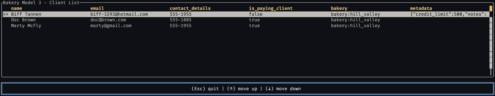

# Vantage UI Adapters

Universal table data adapters for major Rust UI frameworks. This crate bridges between data sources and UI framework table components, with intelligent caching and async data loading.

## Screenshots

| Framework                                                                                               | Screenshot                          |
| ------------------------------------------------------------------------------------------------------- | ----------------------------------- |
| [**egui**](https://github.com/romaninsh/vantage/tree/main/example_egui) - Immediate mode GUI            |        |
| [**GPUI**](https://github.com/romaninsh/vantage/tree/main/example_gpui) - GPU-accelerated UI            |        |
| [**Slint**](https://github.com/romaninsh/vantage/tree/main/example_slint) - Declarative UI toolkit      |      |
| [**Tauri**](https://github.com/romaninsh/vantage/tree/main/example_tauri) - Web-based desktop apps      |      |
| [**Ratatui**](https://github.com/romaninsh/vantage/tree/main/example_tui) - Terminal UI framework       |          |
| [**Cursive**](https://github.com/romaninsh/vantage/tree/main/example_cursive) - Terminal UI with tables |  |

## Quick Start

Add to your `Cargo.toml`:

```toml
[dependencies]
vantage-ui-adapters = { path = ".", features = ["egui"] }
bakery_model3 = { path = "../bakery_model3" }
tokio = { version = "1.0", features = ["macros", "rt-multi-thread"] }
```

Example usage:

```rust
use vantage_ui_adapters::{egui_adapter::EguiTable, TableStore, VantageTableAdapter};
use bakery_model3::*;

#[tokio::main]
async fn main() -> Result<(), Box<dyn std::error::Error>> {
    // Connect to SurrealDB and get client table
    bakery_model3::connect_surrealdb().await?;
    let client_table = Client::table();

    // Create adapter and table
    let client_table_adapter = VantageTableAdapter::new(client_table).await;
    let store = TableStore::new(client_table_adapter);
    let table = EguiTable::new(store).await;

    // Use in your UI framework...
    Ok(())
}
```

## Architecture

- **Vantage Table**: Database tables (e.g. Clients from SurrealDB)
- **UI Adapter**: Bridge layer with caching and async loading
- **UI Framework**: Any supported framework (egui, GPUI, Slint, etc.)

## Supported Frameworks

| Framework   | Type        | Columns | Rows | Auto-refresh | Editing |
| ----------- | ----------- | ------- | ---- | ------------ | ------- |
| **egui**    | Desktop GUI | ✅      | ✅   | ❌           | ❌      |
| **GPUI**    | GPU Desktop | ✅      | ✅   | ❌           | ❌      |
| **Slint**   | Native UI   | ✅      | ✅   | ❌           | ❌      |
| **Tauri**   | Web Desktop | ✅      | ✅   | ❌           | ❌      |
| **Ratatui** | Terminal    | ✅      | ✅   | ❌           | ❌      |
| **Cursive** | Terminal    | ✅      | ✅   | ❌           | ❌      |

## Framework Usage

### egui

```rust
#[tokio::main]
async fn main() -> Result<(), Box<dyn std::error::Error>> {
    let client_table = Client::table();
    let client_table_adapter = VantageTableAdapter::new(client_table).await;
    let store = TableStore::new(client_table_adapter);
    let table = EguiTable::new(store).await;

    let app = TableApp { table };
    eframe::run_native("Client List", options, Box::new(|_cc| Ok(Box::new(app))))?;
    Ok(())
}
```

### GPUI

```rust
#[tokio::main]
async fn main() {
    let client_table = Client::table();
    let client_table_adapter = VantageTableAdapter::new(client_table).await;
    let store = TableStore::new(client_table_adapter);
    let table = GpuiTable::new(store).await;

    gpui::App::new().run(move |cx: &mut AppContext| {
        let app = TableApp { table };
        cx.open_window(WindowOptions::default(), |cx| app.into());
    });
}
```

### Slint

```rust
#[tokio::main]
async fn main() -> Result<(), Box<dyn std::error::Error>> {
    let client_table = Client::table();
    let client_table_adapter = VantageTableAdapter::new(client_table).await;
    let store = TableStore::new(client_table_adapter);
    let table = SlintTable::new(store).await;

    let app = MainWindow::new()?;
    app.set_table_model(table.as_model_rc());
    app.run()?;
    Ok(())
}
```

### Tauri

```rust
#[tokio::main]
async fn main() {
    let client_table = Client::table();
    let client_table_adapter = VantageTableAdapter::new(client_table).await;
    let store = TableStore::new(client_table_adapter);
    let table = TauriTable::new(store).await;

    tauri::Builder::default()
        .manage(table)
        .invoke_handler(tauri::generate_handler![get_table_data, get_table_columns])
        .run(tauri::generate_context!())
        .expect("error while running tauri application");
}
```

### Ratatui

```rust
#[tokio::main]
async fn main() -> Result<(), Box<dyn std::error::Error>> {
    let client_table = Client::table();
    let client_table_adapter = VantageTableAdapter::new(client_table).await;
    let store = TableStore::new(client_table_adapter);
    let mut adapter = RatatuiTableAdapter::new(store);
    adapter.refresh_data().await;

    loop {
        terminal.draw(|f| {
            let table = adapter.create_table();
            f.render_stateful_widget(table, f.area(), adapter.state_mut());
        })?;

        if let Event::Key(key) = event::read()? {
            adapter.handle_key_event(key);
        }
    }
}
```

### Cursive

```rust
#[tokio::main]
async fn main() -> Result<(), Box<dyn std::error::Error>> {
    let client_table = Client::table();
    let client_table_adapter = VantageTableAdapter::new(client_table).await;
    let store = TableStore::new(client_table_adapter);
    let app = CursiveTableApp::new(store).await?;
    app.run()?;
    Ok(())
}
```

## Data Integration

The adapters work with any data source that implements the `DataSet` trait. The included `VantageTableAdapter` connects to SurrealDB via the vantage-table ecosystem:

```rust
// Automatic integration with bakery_model3
let client_table = Client::table();  // From bakery_model3
let client_table_adapter = VantageTableAdapter::new(client_table).await;
let store = TableStore::new(client_table_adapter);
```

## Features

- **Async Data Loading**: Non-blocking data fetching
- **Smart Caching**: Automatic caching with configurable page sizes
- **Real Database Integration**: Works with SurrealDB via vantage-table
- **Cross-Framework**: Same data layer works across all UI frameworks
- **Type Safety**: Full Rust type safety throughout the stack

## Examples

Run the examples to see each framework in action:

```bash
# Desktop examples
cd example_egui && cargo run
cd example_gpui && cargo run
cd example_slint && cargo run
cd example_tauri && cargo run dev

# Terminal examples
cd example_tui && cargo run
cd example_cursive && cargo run
```

## Requirements

- SurrealDB server running on `ws://localhost:8000`
- Rust 1.70+ with async/await support
- UI framework dependencies (installed automatically with features)

### Setting up SurrealDB

The `vantage-surrealdb` crate provides setup scripts to get you started quickly:

```bash
cd vantage-surrealdb

# Start SurrealDB server
./run.sh

# In another terminal, populate with sample data
./ingress.sh
```

This will start SurrealDB on `ws://localhost:8000` and populate it with the bakery model data (clients, orders, products, etc.) that all the UI examples use.

## Contributing

1. Each framework adapter follows the same async loading pattern
2. All examples use the same `bakery_model3` data source
3. No mock data - all adapters work with real SurrealDB data
4. Maintain consistent API across frameworks where possible

## License

MIT License - see LICENSE file for details.
