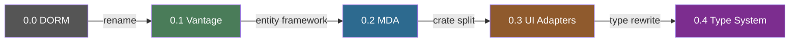
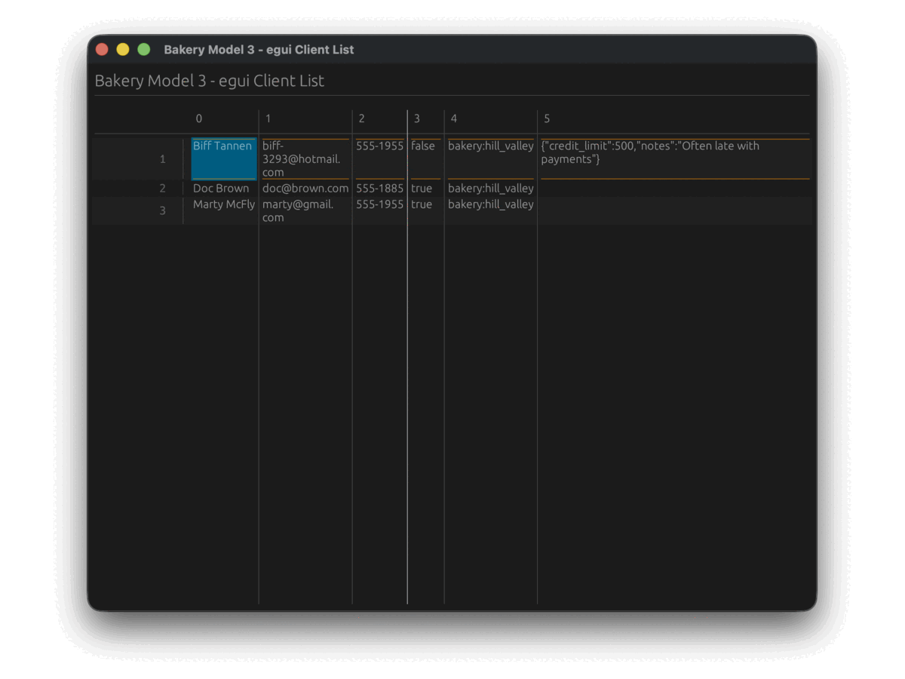

# The Vantage Journey

Vantage didn't start as a multi-backend entity framework. It started as a weekend experiment to see
if Rust could build SQL queries without feeling like Rust.

This page walks you through each release — what changed, why it mattered, and how the API evolved
from raw Postgres queries to a universal persistence layer.

<!-- toc -->



---

## 0.0 — "DORM" (April–November 2024)

The project was originally called **DORM** — the Dry ORM. It was Postgres-only, monolithic, and
proudly opinionated. Everything lived in one crate.

The core idea was already there: **Data Sets**. Instead of loading records eagerly, you describe
_what_ you want and let the framework figure out the query.

```rust
let clients = Client::table();           // Table<Postgres, Client>
let paying = clients.with_condition(
    clients.is_paying_client().eq(&true)
);
let orders = paying.ref_orders();         // Table<Postgres, Order>

for order in orders.get().await? {
    println!("#{} total: ${:.2}", order.id, order.total as f64 / 100.0);
}
```

Behind this innocent-looking code, DORM generated a single SQL query with subqueries, joins, and
soft-delete filters — all derived from model definitions:

```sql
SELECT id,
    (SELECT name FROM client WHERE client.id = ord.client_id) AS client_name,
    (SELECT SUM((SELECT price FROM product WHERE id = product_id) * quantity)
     FROM order_line WHERE order_line.order_id = ord.id) AS total
FROM ord
WHERE client_id IN (SELECT id FROM client WHERE is_paying_client = true)
  AND is_deleted = false
```

No hand-written SQL. No query strings. The framework composed everything from relationship
definitions and table extensions like `SoftDelete`.

```admonish tip title="The Arc breakthrough"
Early commits show a battle with Rust's borrow checker — the infamous "lifetime hell."
The solution came on April 28: switching to `Arc` for shared ownership. This unlocked
clonable data sources and composable table references that define the framework to this day.
```

### Milestones

| Date   | What happened                                       |
| ------ | --------------------------------------------------- |
| Apr 11 | First commit — queries, expressions, SQLite binding |
| Apr 18 | Insert/delete support, first Postgres tests         |
| Apr 28 | `Arc` adoption — escaped lifetime hell              |
| May 14 | `Query::Join` implemented                           |
| May 25 | `has_one`, `has_many`, relationship traversal       |
| May 26 | Bakery model example — all entities defined         |

---

## 0.1 — Vantage is born (December 2024)

On December 12, the framework was renamed from DORM to **Vantage** and published to crates.io for
the first time. The API stayed the same — this was a branding milestone, not an architectural one.

```admonish note title="Why 'Vantage'?"
A vantage point gives you a clear view of the landscape below. The framework gives you
a clear view of your data — no matter where it lives or how complex the relationships are.
```

The same month brought the first Axum integration (`bakery_api`), proving that data sets could drive
REST endpoints naturally:

```rust
async fn list_orders(
    client: axum::extract::Query<OrderRequest>,
    pager: axum::extract::Query<Pagination>,
) -> impl IntoResponse {
    let orders = Client::table()
        .with_id(client.client_id.into())
        .ref_orders();

    let mut query = orders.query();
    query.add_limit(Some(pager.per_page));
    Json(query.get().await.unwrap())
}
```

Tags `v0.1.0` and `v0.1.1` were published the same day. SQLx data source landed 11 days later.

---

## 0.2 — Entity Framework & MDA (February 2025)

Version 0.2 repositioned Vantage as a full **Entity Framework** with Model-Driven Architecture. The
README doubled in size. The vision expanded from "clever query builder" to "how enterprises should
structure business logic."

The key insight: entities aren't just database rows. They're **business objects** that might live in
SQL, NoSQL, a REST API, or a message queue — and your code shouldn't care which.

```rust
impl Client {
    fn table() -> Table<Client, Oracle> { /* ... */ }
    fn registration_queue() -> impl Insertable<Client> { /* Kafka */ }
    fn admin_api() -> impl DataSet<Client> { /* REST */ }
    fn read_csv(file: String) -> impl ReadableDataSet<Client> { /* CSV */ }
}
```

```admonish example title="Same interface, any backend"
A developer calling `Client::registration_queue().insert(id, client).await` doesn't
need to know it's Kafka underneath. The SDK hides the transport — only the entity
contract matters.
```

This release also introduced the idea of **struct projection** — using different Rust types against
the same data set to control which fields get queried:

```rust
struct MiniClient { name: String }
struct FullClient { name: String, email: String, balance: Decimal }

// Only fetches `name` from the database
let name = clients.get_id_as::<MiniClient>(42).await?.name;
```

The monolith was getting heavy, though. Everything still lived in one crate, and adding a new
database meant touching core code.

---

## 0.3 — The Great Separation (July–October 2025)

Version 0.3 broke the monolith into **dedicated crates** and bet heavily on SurrealDB as the primary
backend. The trait-based architecture that defines Vantage today was born here.

```admonish info title="Crate explosion"
One crate became many: `vantage-expressions`, `vantage-table`, `vantage-dataset`,
`vantage-surrealdb`, `surreal-client`, `vantage-config`, `vantage-ui-adapters` — each
with a focused responsibility.
```

Table definitions moved from static initialization to a **builder pattern**:

```rust
// 0.2 — static, Postgres-only
Table::new_with_entity("bakery", postgres())
    .with_id_column("id")
    .with_column("name")
    .with_many("clients", "bakery_id", || Box::new(Client::table()))

// 0.3 — builder, any datasource
Table::<SurrealDB, Client>::new("client", ds.clone())
    .with_id_column("id")
    .with_column("name")
    .with_column("email")
    .with_many("orders", "client_id", || Client::order_table())
```

Field accessors now return `Expression` instead of column objects — making them composable across
query builders:

```rust
// Build conditions from expressions
let active = clients.is_paying_client().eq(true);
let big_spenders = clients.balance().gt(1000);
let query = clients.with_condition(active).with_condition(big_spenders);
```

The **`AnyTable`** type-erasure system arrived, enabling generic code that works with any
datasource:

```rust
let tables: Vec<AnyTable> = vec![
    AnyTable::new(Client::table()),   // SurrealDB
    AnyTable::new(Product::table()),  // SQLite
];

for table in &tables {
    println!("{}: {} records", table.name(), table.count().await?);
}
```

This release culminated with **UI adapters for six frameworks** — egui, GPUI, Slint, Tauri, Ratatui,
and Cursive — all driven by the same `AnyTable` interface.

```admonish success title="One data layer, six UIs"
The same bakery model powered a native desktop app (GPUI), a web app (Tauri), a terminal
dashboard (Ratatui), and three more — without changing a single line of business logic.
```



---

## 0.4 — The Type System Rewrite (November 2025–present)

```admonish info title="Vantage 0.4 — the current release"
Version 0.4 rewrites the type system from the ground up. Custom types per datasource, CBOR
protocol, 7 persistence backends (SurrealDB, Postgres, MySQL, SQLite, MongoDB, CSV, REST API),
`ActiveEntity` / `ActiveRecord` patterns, typed columns, unified error handling, and a progressive
trait model where each persistence only implements what its engine supports.

**[Read the full 0.4 feature guide →](./whats-new-04.md)**
```

---

## The bigger picture

Looking at the trajectory:

| Version | Core idea                     | Backends                                                   | Crates |
| ------- | ----------------------------- | ---------------------------------------------------------- | ------ |
| 0.0     | Can Rust build SQL smartly?   | Postgres                                                   | 1      |
| 0.1     | Let's publish this            | Postgres                                                   | 1      |
| 0.2     | Entity Framework for Rust     | Postgres                                                   | 1      |
| 0.3     | Traits, not inheritance       | SurrealDB, SQLite                                          | 10+    |
| 0.4     | Strict types, any persistence | SurrealDB, SQLite, Postgres, MySQL, MongoDB, CSV, REST API | 20+    |

What started as 16 commits in April 2024 is now **470+ commits**, **189+ pull requests**, and a
framework that can drive the same business logic across five backends and six UI frameworks.

The destination hasn't changed since day one: **describe your data once, use it everywhere.** Each
version just made "everywhere" a little bigger.
