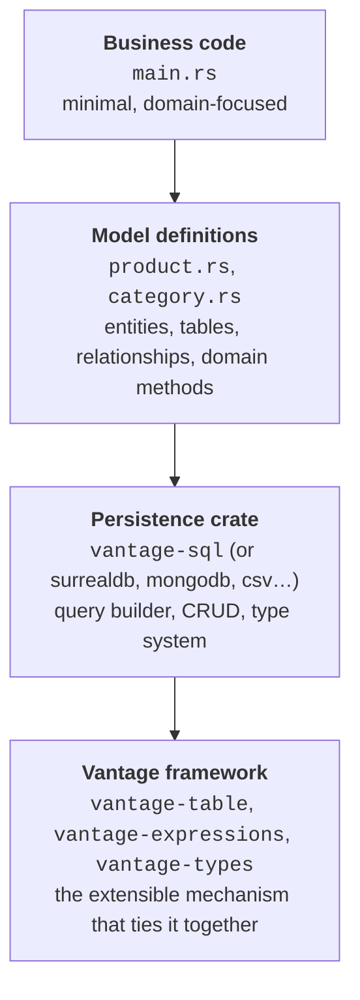

# Tables and Typed Data Access

A table is a structure representing a collection of records in a database:

```rust
let products = Product::table(db);

for (id, product) in products.list().await? {
    println!("{} — {} cents", product.name, product.price);
}
```

Think of `Table<SqliteDB, Product>` as a `Vec<Product>` — except the records aren't in memory. They
live somewhere else (a database, a file, an API), and you don't know how many there are or what they
contain until you list them.

If you've used an ORM before, you might expect Vantage to work with individual records — load one,
change it, save it back. Vantage works differently: you always operate on a **set** of records. A
set might contain one record, no records, or millions — you don't pull them into memory to find out.

Operations like counting, filtering, and updating happen on the database side — Vantage builds the
right query and sends it over. Even traversal operations and sub-queries are done by building
queries and executing remotely — if the database supports it, of course.

When you `.clone()` a table, you don't clone the data — you clone the _definition_. From there you
can narrow it down by adding conditions, turning it into a subset. Some examples of data sets you
might work with:

- all user records except those with a soft-delete flag
- orders placed today
- paid customers
- orders of paid customers
- products that sold at least 5 items today

Each of these is a set — defined by conditions, not a list of IDs. Another typical operation is
expressing one set as a condition of another then perform an action:

- notify customers who have an unpaid invoice older than 30 days
- archive orders whose products have been discontinued
- apply a discount to customers who spent more than $500 this month
- list warehouses that stock at least one out-of-stock product
- flag reviews written by users who have been banned

Put these together and even complex operations are easy to express in code:

```rust
// "notify customers who have an unpaid invoice older than 30 days"
let mut overdue = Invoice::table(db);
overdue.add_condition(overdue["status"].eq("unpaid"));
overdue.add_condition(overdue["issued_at"].lt(days_ago(30)));

overdue.ref_customer().send_reminder().await;
```

```rust
// "apply a discount to customers who spent more than $500 this month"
let mut customers = Customer::table(db);
customers.add_expression("spent_this_month", |c| {
    c.subquery_orders().only_this_month().field_sum("total")
});
customers.add_expression("discount", |c| {
    primitives::ternary(c["spent_this_month"].gt(500), 10, 0)
});
```

Don't worry about the exact syntax — we'll get to all of it. The point is that sets compose
naturally: define one, use it to narrow another, then act on the result.

## Defining a Table

The syntax for defining a table looks similar to query building from chapter 1, but there are
important differences:

|                  | Query                                   | Table                                            |
| ---------------- | --------------------------------------- | ------------------------------------------------ |
| **Lifetime**     | Built, executed, dropped                | Sticks around, spawns many queries               |
| **Operations**   | One SQL statement (SELECT, INSERT, ...) | Higher-level CRUD: list, get, add, patch, delete |
| **Columns**      | String field names via `.with_field()`  | Typed `Column<T>` definitions                    |
| **Database**     | Not bound — just a struct               | Holds a database reference (`Arc`)               |
| **Idempotency**  | INSERT fails on duplicate key           | `replace()` and `delete()` are idempotent        |
| **Data sources** | Only databases with a query language    | Any data source: SQL, CSV, APIs, queues, etc.    |

A [`Table`](vantage_table::table::Table) is typically defined in its own file alongside the entity.
Create `src/product.rs`:

```rust
// src/product.rs
use vantage_sql::prelude::*;
use vantage_types::prelude::*;

#[entity(SqliteType)]
#[derive(Clone, Default)]
pub struct Product {
    pub name: String,
    pub price: i64,
}

impl Product {
    pub fn table(db: SqliteDB) -> Table<SqliteDB, Product> {
        let is_deleted = Column::<bool>::new("is_deleted");
        Table::new("product", db)
            .with_id_column("id")
            .with_column_of::<String>("name")
            .with_column_of::<i64>("price")
            .with_column_of::<bool>("is_deleted")
            .with_condition(is_deleted.eq(false))
    }
}
```

```admonish tip title="Hiding the db argument"
In most cases you already know which database a table lives in — passing `db` every time
is noise. A common pattern is to wrap the connection in a global accessor:

~~~rust
impl Product {
    fn table() -> Table<SqliteDB, Product> {
        Table::new("product", get_sqlite_db())
            // ...columns...
    }
}
~~~

We'll keep passing `db` explicitly in this tutorial for clarity, but real applications
typically use this pattern.
```

This defines the `product` table once. You can now generate queries from it:

```rust
let table = Product::table(db);

// Full SELECT with all columns and conditions applied
let select = table.select();
println!("{}", select.preview());
// SELECT "id", "name", "price", "is_deleted" FROM "product"

// Count query (does not execute — just builds the expression)
let count_query = table.get_count_query();
// SELECT COUNT(*) FROM "product"

// Sum query for a specific column
let sum_query = table.get_sum_query(&table["price"]);
// SELECT SUM("price") FROM "product"
```

These return the same `SqliteSelect` and `Expression` types from chapter 1 — the table just
assembles them for you. But most of the time you won't need the raw query at all.

---

## CRUD operations

With the table defined, all four operations — create, read, update, delete — are one-liners. Each
comes from a trait in the prelude:

```rust
let table = Product::table(db);

// Read — list all, get one by ID
let all = table.list().await?;             // IndexMap<String, Product>
let pie = table.get("pie").await?;         // Option<Product>

// Create — insert with a known ID
let muffin = Product { name: "Muffin".into(), price: 175 };
table.insert(&"muffin".to_string(), &muffin).await?;

// Update — replace the entire record
let updated = Product { name: "Blueberry Muffin".into(), price: 195 };
table.replace(&"muffin".to_string(), &updated).await?;

// Delete
table.delete(&"muffin".to_string()).await?;
```

That's it. `list()` returns an `IndexMap<Id, Product>` — ordered and keyed by ID. `get()` returns
`Option<Product>` — `None` when the ID doesn't exist, so you can pattern-match or `.ok_or(...)` into
your own not-found error. There's also `get_some()` which returns an `(Id, Product)` pair (still
`Option`-wrapped) for sampling, and `insert_return_id()` for when you want the database to generate
the ID.

```admonish tip title="Idempotent operations"
Try duplicating the `replace()` and `delete()` calls — the result is the same. Replacing
a record that already has the new values is a no-op. Deleting a record that's already gone
succeeds silently. This makes table operations safe to retry without worrying about
side effects.
```

---

## Type-erased tables

`Table<SqliteDB, Product>` is great when you know the types at compile time. But what if you want to
write a function that lists _any_ table — products, orders, customers — without knowing the entity
type?

[`AnyTable`](vantage_table::any::AnyTable) wraps a concrete table and erases its type parameters.
Values come back as `Record<serde_json::Value>` instead of typed entities. You can iterate columns
by name and build a generic display:

```rust
async fn list_table(table: &AnyTable) -> VantageResult<()> {
    let columns = table.column_names();

    // Header
    print!("  {:<12}", "id");
    for col in &columns {
        print!("{:<16}", col);
    }
    println!();

    // Rows
    for (id, record) in table.list_values().await? {
        print!("  {:<12}", id);
        for col in &columns {
            let val = record.get(col).map(|v| format!("{}", v)).unwrap_or_default();
            print!("{:<16}", val);
        }
        println!();
    }
    Ok(())
}
```

Convert any typed table into an `AnyTable` with `from_table()`:

```rust
let table = Product::table(db);
let any = AnyTable::from_table(table);

list_table(&any).await?;
// id          name            price
// cupcake     "Cupcake"       120
// donut       "Doughnut"      135
// ...
```

Under the hood, `AnyTable` converts values to and from `serde_json::Value` on the fly. Conditions,
pagination, and all CRUD operations still work — you just lose compile-time type safety on the
entity fields. This is the trade-off: `AnyTable` lets you build generic UI components, CLI tools,
and admin panels that work with any table definition.

```admonish info title="Generics vs type erasure"
You can also write `list_table` using generics — that keeps type safety but limits you
to Rust callers:

~~~rust
async fn list_table<E: Entity + std::fmt::Debug>(
    table: &impl ReadableDataSet<E>,
) -> VantageResult<()> {
    for (id, entity) in table.list().await? {
        println!("  {}: {:?}", id, entity);
    }
    Ok(())
}
~~~

If you plan to expose tables outside of Rust (Python bindings, FFI, a web admin UI),
type erasure via `AnyTable` is the way to go.
```

---

## Relationships

Our database has a `category` table that we haven't used yet. Let's define it and connect it to
products.

Create `src/category.rs`:

```rust
// src/category.rs
use vantage_sql::prelude::*;
use vantage_types::prelude::*;

#[entity(SqliteType)]
#[derive(Debug, Clone, Default)]
pub struct Category {
    pub name: String,
}

impl Category {
    pub fn table(db: SqliteDB) -> Table<SqliteDB, Category> {
        Table::new("category", db)
            .with_id_column("id")
            .with_column_of::<String>("name")
            .with_many("products", "category_id", Product::table)
    }
}
```

The important line is `.with_many("products", "category_id", Product::table)`. This declares:

- **"products"** — the name of the relationship (you'll use this to traverse it)
- **"category_id"** — the foreign key column on the `product` table
- **`Product::table`** — a function that builds the target table (same one we defined earlier)

No changes to `Product` are needed — the relationship is declared on the side that "owns" it.
Category has many products; the foreign key lives on product.

Given a set of categories, `get_ref_as` traverses the relationship and returns matching products:

```rust
let categories = Category::table(db.clone());
let products = categories.get_ref_as::<Product>("products")?;
```

The result is a `Table<SqliteDB, Product>` with an extra condition — only products whose
`category_id` matches one of the category IDs. Narrow the categories first and the subquery narrows
too. Let's use this in a CLI that accepts an optional search filter. The `.with_search()` method
adds a LIKE condition across all columns of the table — handy for quick filtering.

Update `src/main.rs`:

```rust
mod category;
mod product;

use category::Category;
use product::Product;
use vantage_sql::prelude::*;

async fn list_products(table: &Table<SqliteDB, Product>) -> VantageResult<()> {
    for (id, p) in table.list().await? {
        println!("  {:<4} {:<20} {:>3} cents", id, p.name, p.price);
    }
    Ok(())
}

#[tokio::main]
async fn main() {
    if let Err(e) = run().await {
        e.report();
    }
}

async fn run() -> VantageResult<()> {
    let db = SqliteDB::connect("sqlite:products.db")
        .await
        .context("Failed to connect to products.db")?;

    let filter = std::env::args().nth(1);

    let products = match &filter {
        Some(search) => Category::table(db.clone())
            .with_search(search)
            .get_ref_as::<Product>("products")?,
        None => Product::table(db),
    };

    list_products(&products).await?;

    Ok(())
}
```

Try it:

```sh
cargo run                # all active products
cargo run "Sweet"        # Cupcake, Doughnut, Cookies
cargo run "Pastries"     # Tart, Pie
cargo run "t"            # matches "Sweet Treats" AND "Pastries" — 5 products
```

The search `"t"` matches two categories ("Sweet Treats" and "Pastries"), so products from both are
returned.

```admonish info title="Sets, not joins"
Notice what happened with `cargo run "t"`: the search matched **two** categories, and we got
products from **both** — without writing a JOIN or collecting IDs manually.

This is because Vantage relationships work through **sets**. `with_search("t")` narrowed
the category table to two rows. `get_ref_as` then generated a subquery:

~~~sql
SELECT ... FROM "product"
WHERE "category_id" IN (SELECT "id" FROM "category" WHERE "name" LIKE '%t%')
AND "is_deleted" = 0
~~~

The subquery comes from whatever conditions are on the source table. Add more conditions
and the subquery narrows further. The relationship definition stays the same — you never
need to rewrite the traversal logic.
```

---

## Computed fields with expressions

So far, `list_products` only shows name and price. It would be nice to show the category name too —
but `Product` doesn't have a `category` field, and the category name lives in a different table.

Vantage solves this with **expressions** — computed fields that are evaluated as part of the SELECT
query. You define them on the table, and they appear alongside regular columns.

First, add a `with_one` relationship on Product (the reverse of `with_many` on Category):

```rust
.with_one("category", "category_id", Category::table)
```

This says: each product has one category, linked through `category_id`. Now you can use
`get_subquery_as` inside `with_expression` to build a correlated subquery:

```rust
.with_expression("category", |t| {
    t.get_subquery_as::<Category>("category")
        .unwrap()
        .select_column("name")
})
```

`select_column("name")` builds a subquery like
`SELECT "name" FROM "category" WHERE "id" = "product"."category_id"` — a correlated subquery that
fetches the category name for each product row.

Here's the updated `src/product.rs`:

```rust
use vantage_sql::prelude::*;
use vantage_types::prelude::*;

use crate::category::Category;

#[entity(SqliteType)]
#[derive(Debug, Clone, Default)]
pub struct Product {
    pub name: String,
    pub price: i64,
    pub category: Option<String>,
}

impl Product {
    pub fn table(db: SqliteDB) -> Table<SqliteDB, Product> {
        let is_deleted = Column::<bool>::new("is_deleted");
        Table::new("product", db)
            .with_id_column("id")
            .with_column_of::<String>("name")
            .with_column_of::<i64>("price")
            .with_column_of::<bool>("is_deleted")
            .with_condition(is_deleted.eq(false))
            .with_one("category", "category_id", Category::table)
            .with_expression("category", |t| {
                t.get_subquery_as::<Category>("category")
                    .unwrap()
                    .select_column("name")
            })
    }
}
```

A few things to note:

- **`category: Option<String>`** — the field is `Option` because a product might not have a category
  (NULL in the database). The expression result is deserialized into this field automatically.
- **No `with_column_of` for "category"** — the expression replaces what would normally be a column.
  Vantage adds it to the SELECT as a computed field.
- **`with_one` + `with_expression`** — the relationship defines how to traverse; the expression
  defines what to fetch. They work together but serve different purposes.

Update `list_products` to show the category:

```rust
async fn list_products(table: &Table<SqliteDB, Product>) -> VantageResult<()> {
    for (id, p) in table.list().await? {
        let cat = p.category.as_deref().unwrap_or("-");
        println!("  {:<4} {:<20} {:>3} cents  [{}]", id, p.name, p.price, cat);
    }
    Ok(())
}
```

Run it:

```sh
cargo run
```

```text
  1    Cupcake              120 cents  [Sweet Treats]
  2    Doughnut             135 cents  [Sweet Treats]
  3    Tart                 220 cents  [Pastries]
  4    Pie                  299 cents  [Pastries]
  5    Cookies              199 cents  [Sweet Treats]
  7    Sourdough Loaf       350 cents  [Breads]
```

The category name comes from a subquery — no JOIN, no extra round trip. And the category filter
still works:

```sh
cargo run "t"
```

```text
  1    Cupcake              120 cents  [Sweet Treats]
  2    Doughnut             135 cents  [Sweet Treats]
  3    Tart                 220 cents  [Pastries]
  4    Pie                  299 cents  [Pastries]
  5    Cookies              199 cents  [Sweet Treats]
```

```admonish info title="Expressions compose"
Expressions can reference other expressions. For example, we could add a `product_count`
expression to Category that counts products via a subquery, then build a `title` expression
that combines the name and count:

~~~rust
// In Category::table()
.with_expression("product_count", |t| {
    t.get_subquery_as::<Product>("products")
        .unwrap()
        .get_count_query()
})
.with_expression("title", |t| {
    let name = t.get_column_expr("name").unwrap();
    let count = t.get_column_expr("product_count").unwrap();
    concat_!(name, " (", count, ")").expr()
})
~~~

`get_column_expr` returns the expression for either a real column or a computed expression
by name. Here it resolves `"product_count"` to the count subquery, so `title` becomes
something like `name || ' (' || (SELECT COUNT(*) FROM product WHERE ...) || ')'`.

Now change Product's `category` expression to fetch `title` instead of `name`:

~~~rust
.with_expression("category", |t| {
    t.get_subquery_as::<Category>("category")
        .unwrap()
        .select_column("title")
})
~~~

`select_column("title")` resolves the `title` expression on Category and builds it into
the subquery. The result:

~~~text
  1    Cupcake              120 cents  [Sweet Treats (3)]
  2    Doughnut             135 cents  [Sweet Treats (3)]
  3    Tart                 220 cents  [Pastries (2)]
  4    Pie                  299 cents  [Pastries (2)]
  5    Cookies              199 cents  [Sweet Treats (3)]
  7    Sourdough Loaf       350 cents  [Breads (1)]
~~~

Vantage renders everything into a single SQL query. The nested subqueries might look
redundant, but modern SQL databases optimise and execute them efficiently — there's no
extra round trip to the database.
```

---

## Extension traits

Throughout this chapter you've seen calls like `categories.get_ref_as::<Product>("products")`. The
turbofish `::<Product>` and the string `"products"` are repetitive and error-prone — get the string
wrong and you get a runtime error.

Rust's extension traits solve this. Define a trait on `Table<SqliteDB, Category>` that wraps the
traversal:

```rust
pub trait CategoryTable: ReadableDataSet<Category> {
    fn ref_products(&self) -> Table<SqliteDB, Product> {
        self.get_ref_as("products").unwrap()
    }
}
impl CategoryTable for Table<SqliteDB, Category> {}
```

The default method lives in the trait — `impl` is just `{}`. The `unwrap()` is safe because we know
"products" is defined on every `CategoryTable`. If the string were wrong, it would panic immediately
during development, not silently fail at runtime.

Now callers write `categories.ref_products()` — no turbofish, no string, no `?`, and the compiler
catches typos.

The same pattern works for typed column access:

```rust
pub trait ProductTable {
    fn price(&self) -> Column<i64> {
        self.get_column("price").unwrap()
    }
}
impl ProductTable for Table<SqliteDB, Product> {}
```

With both traits in place, code reads naturally:

```rust
let expensive = categories
    .ref_products()
    .with_condition(products.price().gt(200));
```

```admonish tip title="Where to put extension traits"
Define extension traits in the same file as the entity — `product.rs` gets `ProductTable`,
`category.rs` gets `CategoryTable`. They're part of your model's public API: anyone who
imports the entity gets the typed accessors for free.

This is how Vantage scales to large codebases. The table definition (columns, conditions,
relationships, expressions) is declared once. Extension traits give it a clean, typed API.
Business logic code never sees raw strings or turbofish — just method calls.
```

```admonish info title="Custom methods on extension traits"
Extension traits aren't limited to column and relationship accessors — you can add any
business logic. For example, the `vantage-cli-util` crate provides `print_table()` for
terminal output. Add it as a method on your trait:

~~~rust
use vantage_cli_util::table_display;

pub trait ProductTable {
    fn price(&self) -> Column<i64> {
        self.get_column("price").unwrap()
    }

    async fn print(&self) -> VantageResult<()> {
        table_display::print_table(self).await
    }
}
~~~

Now `products.print().await?` gives you a formatted table in the terminal:

~~~text
+----+----------------+-------+-------------------+
| id | name           | price | category          |
+----+----------------+-------+-------------------+
| 1  | Cupcake        | 120   | Sweet Treats (3)  |
| 2  | Doughnut       | 135   | Sweet Treats (3)  |
| 3  | Tart           | 220   | Pastries (2)      |
| ...                                              |
+----+----------------+-------+-------------------+
~~~

Other methods you might add: `only_expensive()` that returns a filtered clone,
`total_revenue()` that computes a sum, or `export_csv()` that writes to a file.
The table is yours to extend.
```

---

## Persistence Abstraction

It is time for a pause and reflection. The files you have written so far — `Cargo.toml`,
`product.rs`, `category.rs`, `main.rs` — are the makings of an extensible business software
architecture. Scalable, maintainable, testable, and portable across databases without rewriting a
single line of business logic.

What you have is four distinct components, each with a clear job:



The majority of your business code can work with data without any knowledge of where it's stored or
how. It operates on typed entities, relationships, and domain methods — nothing else.

The model definitions focus on describing _where_ and _how_ data is stored, but they don't
micro-manage the process. If storage requirements change — a new backend, a schema migration, a
cached layer in front — the model is where you make the tweaks. Business code remains untouched.

This separation gives you:

- [x] **Separation of concerns** - framework to establish great design for your software from day
      one, then scale.
- [x] **No ripple effect** — in Rust code refactoring cascade through entire codebase. Vantage model
      layer contains that pain, and enterprise codebases don't unravel when requirements shift.
- [x] **Concise syntax** — the ergonomics Python, JavaScript, and PHP developers enjoy, now in Rust.
      Cuting boilerplate, making code readablle.
- [x] **Strong types, zero cost** — everything TypeScript has and more, without sacrificing
      performance. The abstraction compiles down to direct calls.
- [x] **A usable alternative to OOP** — Java and C# developers get entities, methods, and
      composition without inheritance hierarchies or dependency injection containers.
- [x] **Safe concurrency, async, ownership, no memory leaks** — the performance of C with ergonomics
      that make concurrent code readable.
- [x] **Portability** — take Vantage with you anywhere: server, desktop, web, mobile, embedded. One
      static binary per target.

```admonish tip title="A sneak peek at what's next"
This introduction gets you productive quickly, but it barely scratches the surface.
Later chapters explore more complex challenges that make Vantage is equipped to deal with:

- **Zero-cost cross-persistence traversal** — follow a relationship from a Postgres table
  into a MongoDB collection, all expressed in Rust, executed efficiently on each side.
- **In-memory entity caching with indexing** — Using `vantage-redb` for powerful and
  transparent client-side caching.
- **Facades and middleware APIs, almost for free** — wrap your model to expose a filtered
  or transformed view to another team an API.
- **Super-efficient API clients and SDKs** — your model becomes the client. Typed endpoints,
  retries, pagination, and rate limits — all in one abstraction.
- **UI framework integration** — the same model drives desktop, terminal, web, and mobile
  UIs through `vantage-ui-adapters`. Define once, render anywhere.
- **Reactive in-memory data** — make your local data reactive, receiving live updates
  from your database or websocket APIs.

The patterns you've learned scale all the way up.
```
