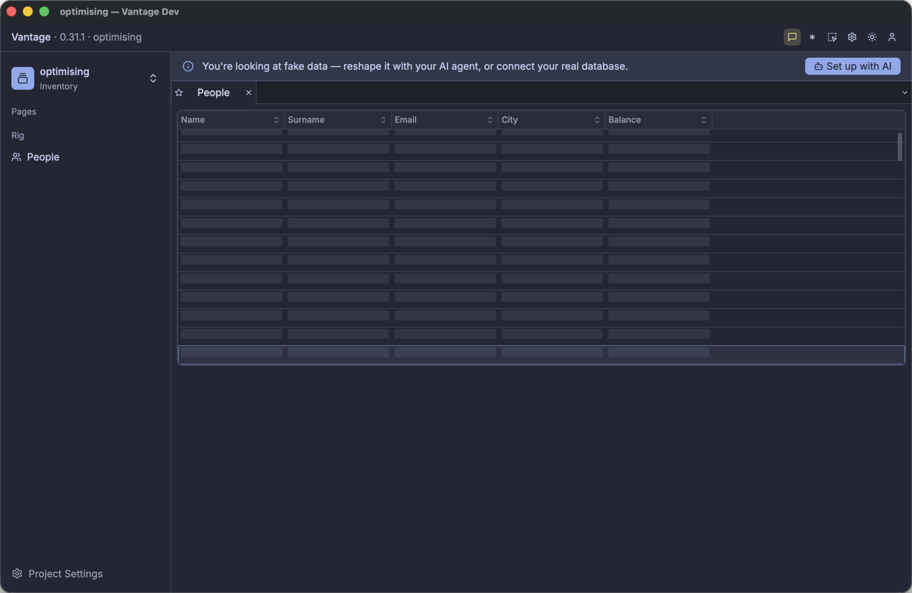

# Reading the Debug Stream

The first thing that you learn from the stream is which line agrees with which moment on screen.
Keep the window and the terminal beside each other. Sort a column, type in the quick-search box, and
scroll, and watch which lines each action produces.

That is much easier when each request needs three seconds than when it needs 40 milliseconds.

## Make the source slow

A source that answers in 40ms hides its behaviour. The rows are simply present, and a load is one
flicker between two frames.

Change one value in the datasource. Each fetch then becomes an event with a start and an end.

```yaml
# datasource/people.yaml
shape:
  capabilities: [count, fetch_window, order, search]
  latency:
    window: 3s          # each batch of rows costs three seconds
    get: 500ms..1s      # each single record costs half a second or more
```

The two classes pay for different requests:

| Latency class | The request that pays it | What causes it on screen |
| --- | --- | --- |
| `window` | A range of rows, such as rows 500 to 600 | The grid scrolls into rows that the cache does not hold |
| `get` | One record, by its id | A click on a row, which opens the details panel |

`window` is the class that this chapter measures. A grid asks for ranges, and each unnecessary range
is a fetch that you can count. Give `get` a value as well, so that a click on a row is also visible
in the stream.

Nothing else changes: the same table, the same page, and the same 200,000 rows. But each decision of
the framework now takes clock time that you can see.



Open the page and watch it load:

1. The window opens immediately, and the page then needs a few seconds to mount. That delay is the
   fixture, not the framework: `count: 200000` makes faker generate 200,000 rows at each start.
   Decrease `count` if you do not want it.
2. **Skeleton rows** appear. A skeleton row has a position, but no contents. The grid gave a position
   to each of the 200,000 rows, because the source declared `count`, so the scrollbar has the correct
   size before any row arrives.
3. The first batch arrives three seconds later, and those rows paint together.
4. Scroll past them. The same sequence occurs again.

Now scroll back to the top. **Nothing happens.** There is no delay and there are no skeleton rows.
That is the cache, and it is your first measurement: to return to a position that you visited costs
nothing.

## Cold runs and warm runs

There is one cache file for each datasource, under `~/Library/Caches/Vantage/<project>-<hash>/`.
Delete the folder for a cold run:

```sh
rm -rf ~/Library/Caches/Vantage/optimising-*
```

A cold run and a warm run are two different experiments. A cold run answers "what does the first open
cost?". A warm run starts from a full cache and answers "what does the application do with rows that
it already holds?". Too many refreshes appear in the warm run.

The two sets of numbers are not comparable. Record which run you did, each time.

## Understanding the log

The debug stream shares the terminal with the ordinary log of the application:

```text
12:23:58.222  people  dio  created over "people" — cache table "people_people", 422 rows already held from a previous session
2026-07-31T11:23:58.242796Z  INFO build_page_for_key{page_key="people" …}:build_entity{key="people"
  datasource=Some("people")}: vantage_ui: entity open, by phase key=people/people ms=2791
  breakdown=vista=2722ms cache=49ms dio=0ms scenery=18ms
12:23:58.341  people  dio  fetch #1 asks for rows 0..22 — 0 missing, 22 already held
12:23:58.420  people  dio  fetch #1 got 22 rows in 79ms
```

The short lines are the debug stream. Each one has four parts, always in this sequence:

| Part | Example | What it is |
| --- | --- | --- |
| time | `12:23:58.341` | Local time, to the millisecond |
| table | `people` | The datasource with debug switched on. With one datasource for each table, this is also the table. |
| origin | `dio` | The part of the framework that wrote the line |
| message | `fetch #1 asks for rows 0..22 …` | One sentence, in units that a person reads: `3.0s`, `24KB`, `200,000`, `0.1%` |

Each request has an identifier, such as `fetch #1`. The identifier connects a request to its result.
There is one sequence for each Dio, and it starts at 1.

```admonish note title="The sequence of lines in one load is not a contract"
The lines from one load do not always appear in the same sequence. The framework writes the cache
line and the state line *inside* the operation that the result line completes. Both can therefore
come before the result line.

Use `fetch #N` to connect the lines. Do not use their positions.
```

The origin is what you search for. There are twelve origins:

| Origin | What the line reports |
| --- | --- |
| `dio` | The framework created a Dio. Or a fetch **asks for** a range, **got** rows, or **failed**. |
| `source` | What the source can do and cannot do, and which load method follows. One line, at open. |
| `scenery` | A view opened with a full or an empty cache. Or the load state changed. |
| `census` | A consumer attached or detached. Consumers are table sceneries, record sceneries, and servos, which watch one value. The line gives the current counts and the memory. |
| `viewport` | The range that a consumer declared. **Coalesced** means that several scroll events became one range. |
| `cache` | The framework wrote rows. Or it **served** a viewport **locally**, with no fetch. |
| `payload` | The columns that arrived, the columns that a view wants, and the size in bytes. |
| `total` | The total count changed, and what supplied the new value. |
| `sort` | A sort changed. Says whether the source does the work. |
| `search` | A search changed. Says whether the source does the work. |
| `hydrate` | A second pass fetched the remaining columns of rows that are on screen. Section 4 explains the two passes. |
| `summary` | The session summary, printed when Vantage UI quits. |

## Read one origin at a time

Write the session to a file, then read one origin:

```sh
vantage-ui ./optimising --page=people 2>&1 | tee /tmp/optimising.log
grep ' dio ' /tmp/optimising.log
```

```text
12:23:58.222  people  dio  created over "people" — cache table "people_people", 422 rows already held from a previous session
12:23:58.341  people  dio  fetch #1 asks for rows 0..22 — 0 missing, 22 already held
12:23:58.420  people  dio  fetch #1 got 22 rows in 79ms
12:24:11.295  people  dio  fetch #2 asks for rows 316..339 — 23 missing, 0 already held · sorted by city Desc
12:24:16.842  people  dio  fetch #2 got 23 rows in 5.5s  ⚠ slow
```

Five lines report a whole session:

- The cache was **warm**: 422 rows from an earlier run. A cold start says *nothing held yet* here.
- `fetch #1` asked for 22 rows that the cache already held. A warm start still asks the source for
  the window on screen, to check that the held rows are current.
- Between `12:23:58.420` and `12:24:11.295` there is no line. Thirteen seconds of use cost no
  request.
- `fetch #2` carries `sorted by city Desc`. The sort went to the source, and the source applied it to
  all 200,000 rows, and not to the rows that the cache held.
- That sorted request cost 5.5s. **⚠ slow** marks each request of one second or more.

Read the other origins in the same way:

```sh
grep ' cache '          /tmp/optimising.log   # what the cache wrote, and what it served
grep 'served locally'   /tmp/optimising.log   # the viewports that cost nothing
grep -E 'asks for|got ' /tmp/optimising.log   # the network, and nothing else
```

Scroll while you watch `tail -f` on the file. Each three-second delay must have one `asks for` line
and one `got` line. Each immediate repaint must have a `served locally` line, or no line.

**A delay with no request is a fault in the UI. A request with no delay is a request that you did
not need.**

## A full cold open

This is the output of the `optimising` project, with high latency and an empty cache, when the
People page opens. It is a capture, not an example.

```text
21:20:15.397  people  dio       created over "people" — cache table "people_people", nothing held yet
21:20:15.399  people  source    can count, window, order, search · pages lazily, 100 rows at a time
21:20:15.401  people  scenery   opened cold — 0 rows seeded from cache
21:20:15.401  people  census    +1 table scenery — now 1 table, 0 record, 0 servo · rss 313MB
21:20:15.455  people  viewport  rows 0..200 — 2 scroll events coalesced into one
21:20:15.455  people  dio       fetch #1 asks for rows 0..200 — 200 missing, 0 already held
21:20:18.493  people  cache     +200 new, 0 updated — now holding 200 of 200,000 (0.1%)
21:20:18.494  people  scenery   opening → partial (chunk load succeeded)
21:20:18.494  people  dio       fetch #1 got 200 rows in 3.0s  ⚠ slow
21:20:18.494  people  payload   6 columns received · no view declared what it needs, so all were
                                fetched · 23KB · id,name,surname,email,city,balance
21:20:18.494  people  total     200,000 rows — stated by the source in the same response
21:20:18.551  people  cache     all 13 rows of 0..13 served locally — no fetch
```

The framework creates the Dio before any view can use it, and its cache table is empty. That is the
cold start. The `source` line gives the contract that each following line obeys.

The binder declares a viewport of 200 rows, and not the 13 rows that you can see. The loader reads
ahead of the screen, so that the next scroll costs nothing. Section 4 measures this.

The `source` line says 100 rows for each page, and the first fetch asks for 200. The first fetch
covers the opening viewport, which the binder sets to 200 rows. Later fetches use the page size of
100.

Then the delay: from `.455` to `18.493`, three seconds. Four facts then arrive together:

- the cache holds the rows — 200 of 200,000, which is 0.1%
- the view is no longer in the loading state
- the fetch reports its cost
- the total is known, because the source supplied it in the same response

The last line is the result: the grid painted 13 rows and made no fetch.

Now scroll. Most of the output is that same line:

```text
21:20:20.401  people  viewport  rows 29..43 — 5 scroll events coalesced into one
21:20:20.401  people  cache     all 14 rows of 29..43 served locally — no fetch
```

## The summary at the end

When you quit, the framework prints the summary of the session:

```text
21:20:33.374  — diorama session summary —
21:20:33.374  people     summary  3 fetches, 0 repeats · 400 rows, 0 redundant · 9.1s waiting, 3.0s slowest
21:20:33.374             summary  1 dio, 1 table scenery, 0 record, 0 servo still alive
21:20:33.374             summary  session 18.0s · cpu 15.0s · peak rss 352MB
```

Two numbers in the first line are important. The other sections keep both at zero.

- **`repeats`** is the count of ranges that the application fetched more than one time.
- **`redundant`** is the count of rows that arrived when the cache already held them. A warm
  revalidation gives a small number. A number equal to the count of rows that arrived means that the
  application fetched a full page for nothing.

The second line finds leaks. Close a page, and the counts must decrease. If the count of sceneries
increases while you move between pages, something keeps views alive after their page closed.

---

## What we covered

| Item | What it does |
| --- | --- |
| `latency.window: 3s` | Separates the events, so that you can attribute each line to a moment |
| `~/Library/Caches/Vantage/<project>-<hash>/` | The location of the cache. Delete it for a cold run. |
| `debug: true` | Switches the stream on for one datasource. The others stay silent. |
| `vantage_diorama::debug` | The one target, at `info`. It appears without `RUST_LOG`. |
| time · datasource · tag · clause | The four parts of each line. `fetch #N` connects a request to its result. |
| `served locally — no fetch` | The line that reports a viewport that cost nothing |
| `repeats` / `redundant` | The two waste counters in the session summary |

```admonish tip title="What is next"
The next section removes the capabilities of the source, one at a time, and finds where the work
goes. A sort that the source cannot do does not stop. It moves to a more expensive place, and it
uses only the rows that the application loaded.
```
