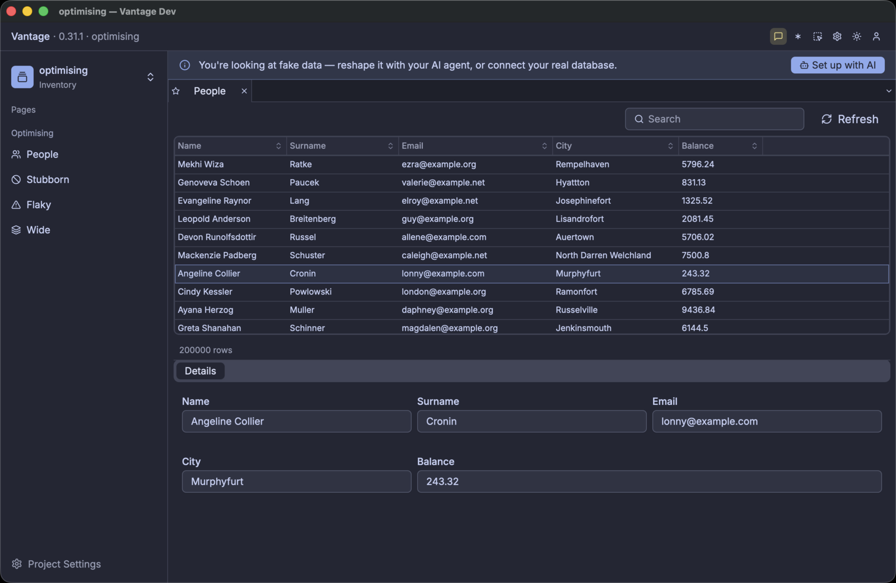

# The setup

An enterprise source holds millions of records, and there can be hundreds of changes each second.
The change channels are coarse: one channel for each table. But no user observes millions of
records. A user looks at 20 or 30 rows, and possibly at some aggregated values.

A Vantage client makes the distinction. Vantage UI connects to the datasource and then narrows the
data to a **viewport**, which is the set of rows on screen. A live cache at the edge follows the same
principle when it drives a frontend application: it holds a fragment of the table, and it forwards
the changes that touch that fragment. The cache is the same cache in both cases, so what you learn
here against Vantage UI transfers to the other components.

To measure a cache strategy you need three things:

- a source whose behaviour you control: fast, slow, unreliable, or fast-changing
- a consumer that you can navigate by hand and check by eye
- full transparency into the cache mechanics, through a real-time log

This chapter uses a **Vantage Faker** datasource, Vantage UI, and the full cache log.

## Create a project

Vantage UI is a free download from [vantage-ui.com](https://vantage-ui.com). It installs as a normal
macOS application.

Start it normally, create a new project, and choose **Fake Data** in the wizard. Then find the
project folder — this chapter calls it `optimising` — and examine the structure inside:

```text
optimising/
├── datasource/people.yaml     where the rows come from
├── table/people.yaml          the columns, and which datasource supplies them
├── page/people.yaml           what the screen shows
└── menu/left.yaml             how to open the page
```

A project is a folder of YAML, and each folder holds one kind of declaration. Change the four files
to match the listings below.

The datasource is a **faker** source. It generates rows instead of fetching them, and you declare how
it behaves. This one holds 200,000 personal records: names, surnames, emails, and some additional
data.

```yaml
# datasource/people.yaml
type: faker
effect: static
count: 200000
seed: 103
shape:
  capabilities: [count, fetch_window, order, search]
  latency:
    window: 10ms..40ms
    get: 5ms..20ms
```

```admonish note title="The capabilities list"
`capabilities` is the contract of the source. A real driver declares what it can do, and faker
declares what you tell it to. The list above mimics a SQL source:

- **`count`** — the source reports how many rows the table holds. The grid then knows the size of the
  scrollbar before it has any row.
- **`fetch_window`** — the source serves a range, such as rows 500 to 600. Without it, the only
  operation is "read everything".
- **`order`** — the source sorts. A sort then applies to all the rows, and not to the loaded rows.
- **`search`** — the source filters, with the same condition.

The source refuses each operation that is not in the list, and the work then moves to the client.
Section 3 removes them one at a time.

[Vista — the Universal Data Handle](../intro/step4-vista.md) describes the full set of capability
flags and how a driver declares them.
```

Once the datasource exists, declare the tables on it. Each table names its columns and the datasource
that supplies them:

```yaml
# table/people.yaml
datasource: people
title: People
columns:
  - { name: id,      type: string,  flags: [id] }
  - { name: name,    type: string,  flags: [title, searchable] }
  - { name: surname, type: string,  flags: [title, searchable] }
  - { name: email,   type: string }
  - { name: city,    type: string }
  - { name: balance, type: decimal }
```

Each column name is significant. `name` generates human names, `surname` generates surnames, and
`email` generates email addresses. Faker uses the column name first and the declared type second, so
a name that faker does not recognise gets a value from its type. Every value is fake, and faker
generates all of them at start-up from the `seed`.

Use realistic names. Much of this chapter measures size, and a table of `row_1` and `row_2` values
makes each of those measurements wrong.

```admonish note title="Use one faker datasource for each table"
A table file follows the Vantage YAML specification, which is the same for every datasource type. It
declares columns, types, and flags, and nothing more. A datasource file has no such restriction, so
each faker knob is there: `count`, `seed`, `effect`, and the full `shape:` block.

One faker datasource therefore describes one set of rows. Give each table its own datasource. This
chapter builds four: `people`, `stubborn`, `flaky`, and `wide`, one for each behaviour that it
measures.
```

The page shows a **binder**. A binder appears as a full CRUD screen: it lists the rows, it edits them
when the source supports editing, it has a quick-search box and column ordering, and a click on a row
opens a summary of that row. Behind the screen it keeps its viewport equal to the rows that you see.

Vantage UI also has a `kind: grid` component. A grid has no search box, so this chapter uses a
binder.

```yaml
# page/people.yaml
title: People
body:
  - kind: binder
    name: people
    observe: people
    params:
      columns:
        name:    { width: 160 }
        surname: { width: 160 }
        email:   { width: 220 }
        city:    { width: 180 }
        balance: { width: 120 }
```

The menu makes the page available:

```yaml
# menu/left.yaml
title: Optimising
items:
  - section: Optimising
    children:
      - page: people
        label: People
        icon: Users
```

## Run it

Each later section starts Vantage UI again from the command line, and not from the Finder. The binary
in the bundle accepts arguments, and the debug output goes to stdout. Make an alias:

```sh
alias vantage-ui='/Applications/Vantage.app/Contents/MacOS/vantage-ui'
```

```sh
vantage-ui ./optimising --page=people
```



The binder lists the rows, and a click on a row fills the details panel below it. The row count says
200000, because the source counted the set. Scrolling is smooth, and no row stays empty for long
enough to see.

The first argument is the project folder. `--page=<key>` opens that page instead of the first entry
in the menu. This matters: a page that you did not intend to measure also opens a Dio, and its
requests go into the same statistics.

```admonish note title="Keep the project simple"
Vantage UI builds one Dio for each observed table, when a page that observes it opens. The other YAML
files in the folder cost nothing until you open them.

Two conditions make a measurement unclear:

1. One page with components that observe different tables. Each component has its own Dio and sends
   its own requests.
2. Tabs that stay open behind the page that you measure. Each open tab keeps its Dios active.

Use one table, one binder, and one variable. Close the pages that you do not measure.
```

````admonish info title="Using faker in Rust"
This chapter uses Vantage UI, because Vantage UI supplies the viewport. The faker source does not
need Vantage UI. `vantage-faker` is a normal crate, and the YAML above is a
[`BackendShape`](https://docs.rs/vantage-faker/latest/vantage_faker/shape/struct.BackendShape.html)
in a file. This code builds the same datasource:

```rust
use std::time::Duration;
use vantage_faker::{BackendShape, FakerTable, Latency, LatencyModel, StaticEffect};
use vantage_vista::VistaCapabilities;

let table = FakerTable::build_shaped(
    "people",
    columns,                       // Vec<FakerColumn> — name, type, flags
    "id",
    Box::new(StaticEffect { count: 200_000 }),
    BackendShape {
        capabilities: VistaCapabilities {
            can_count: true,
            can_fetch_window: true,
            can_order: true,
            can_search: true,
            ..VistaCapabilities::default()
        },
        latency: LatencyModel {
            window: Some(Latency::between(
                Duration::from_millis(10),
                Duration::from_millis(40),
            )),
            get: Some(Latency::between(
                Duration::from_millis(5),
                Duration::from_millis(20),
            )),
            ..LatencyModel::default()
        },
        seed: Some(103),
        ..BackendShape::default()
    },
);

// From here, this is the normal reactive stack. Nothing is faker-specific.
let (vista, _handle) = table.split();
let dio = lens.make_dio(vista).await?;
```

Use this code when your own code is the consumer: an integration test that calls `set_viewport`, a
CLI, or a scenery in a terminal.

Keep the handle. If you drop the handle, the effect loop stops, and a live effect then stops changing
the data.
````

## Switch on the debug stream

Delete the cache and start Vantage UI again. Each measurement in this chapter starts from an empty
cache, because a full cache serves the first screen and asks the source for nothing.

```sh
rm -rf ~/Library/Caches/Vantage/optimising-*
vantage-ui ./optimising --page=people
```

Without the debug flag, the output describes the start-up and nothing else:

```text
INFO vantage_ui: starting root="…/optimising" has_project=true
INFO catalog: loaded datasource key="people"
INFO catalog: loaded table key="people"
INFO catalog: loaded framework page key="people"
INFO vantage_ui: Dio cache dir path="~/Library/Caches/Vantage/optimising-c79233058eb9f98f"
INFO vantage_ui: configured faker datasource datasource=people effect=Some("static")
INFO vantage_ui: entity open, by phase key=people/people ms=2891
                 breakdown=vista=2798ms cache=82ms dio=2ms scenery=7ms
```

This tells you what loaded. The last line is the only measurement: 2.8 seconds inside the Vista,
which is faker generating 200,000 rows at start-up. Nothing here reports a request, a cache hit, or a
row.

Now add one line to the datasource:

```yaml
# datasource/people.yaml
type: faker
effect: static
debug: true          # ← add this
count: 200000
```

Delete the cache and start it again:

```sh
rm -rf ~/Library/Caches/Vantage/optimising-*
vantage-ui ./optimising --page=people
```

A second stream now appears beside the log:

```text
11:53:45.591  people  dio       created over "people" — cache table "people_people", nothing held yet
11:53:45.592  people  source    can count, window, order, search · pages lazily, 100 rows at a time
11:53:45.592  people  scenery   opened cold — 0 rows seeded from cache
11:53:45.593  people  census    +1 table scenery — now 1 table, 0 record, 0 servo · rss 310MB
11:53:45.645  people  viewport  rows 0..200 — 2 scroll events coalesced into one
11:53:45.645  people  dio       fetch #1 asks for rows 0..200 — 200 missing, 0 already held
11:53:45.715  people  cache     +200 new, 0 updated — now holding 200 of 200,000 (0.1%)
11:53:45.715  people  scenery   opening → partial (chunk load succeeded)
11:53:45.716  people  dio       fetch #1 got 200 rows in 70ms
11:53:45.716  people  payload   6 columns received · no view declared what it needs, so all were
                                fetched · 23KB · id,name,surname,email,city,balance
11:53:45.717  people  total     200,000 rows — stated by the source in the same response
11:53:45.821  people  cache     all 22 rows of 0..22 served locally — no fetch
```

That is one page opening, from an empty cache. The binder asked for 200 rows, one request supplied
them, and the last line is the repaint that followed: 22 rows on screen, no request.

The flag applies to one datasource. It is not a global setting. Your other datasources stay silent,
so the question is always "what does **this** table do?".

```admonish tip title="What is next"
The next section makes the source slow, so that each of these lines separates in time. It then reads
the stream line by line.
```
