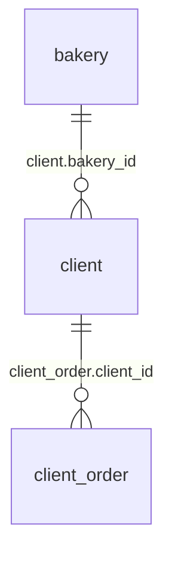
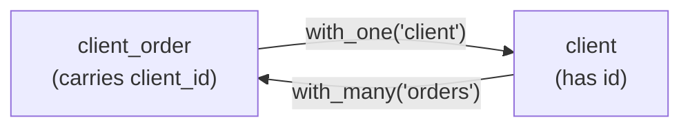

# Relations & Traversal

Vantage treats a relation as something you *traverse*, not something you *load*. Declared once on
the model, a relation gives you:

1. **Set-to-set traversal** — narrow "clients" down to the paying ones, traverse, and you hold
   "orders of paying clients" as a new set. One query when it executes; no loop over IDs.
2. **Related values inside queries** — a client row carrying its `order_count`, an order carrying
   its `client.name` — computed by the database through correlated subqueries or native link paths.
3. **The same vocabulary on every backend** — relations are declared on the model, not read from
   foreign-key constraints, so CSV files, REST APIs, and document stores get the same treatment as
   SQL.
4. **Relations that survive the stack** — the declaration travels from the typed `Table` through
   the type-erased `Vista` into the cached `Dio`; where two datasources meet, the Dio stitches the
   join client-side.

If you come from an ORM, the shape is different enough to spell out:

|                        | typical ORM                          | Vantage                                          |
| ---------------------- | ------------------------------------ | ------------------------------------------------ |
| Traversal returns      | loaded objects (lazy or eager)       | a new set — a query definition, no data loaded   |
| N+1 queries            | managed with eager-loading hints     | don't arise: traversal is one subquery           |
| Declared               | derived from schema / migrations     | on the model; works without FK constraints       |
| Backends               | the SQL database                     | SQL, SurrealDB, MongoDB, CSV, REST, DynamoDB, …  |
| Related fields         | JOIN and map, or embedded objects    | subquery expressions, implicit references        |
| Across two databases   | out of scope                         | catalog traversal; augmentation joins per row in the cache |

Our running example is `bakery_model3` — an example model crate that ships in the Vantage
repository. It defines one set of entities (bakeries, clients, orders, products) with table
constructors for several datasources — SQLite, PostgreSQL, SurrealDB, MongoDB, CSV, DynamoDB —
and doubles as a test fixture for the framework itself.
[Model-Driven Architecture](mda.md) walks through its anatomy; here we just borrow it as the
example.

Three of its tables belong together: a `Bakery` has many `Clients`, and each `Client` has many
`Orders`. In SQL terms, `client.bakery_id` points at a bakery and `client_order.client_id` points
at a client:



Almost every real question you'd ask of this data crosses one of those links —
"orders of paying clients", "which bakery does this order belong to" — so this guide is about how
Vantage models those links and how you cross them.

You met relations briefly in the [Introduction](intro/step2-tables.md), where a product catalog
picked up `with_many` and `get_ref_as`; this guide covers the same machinery in depth, with a fuller
model. We work SQL-first here (SQLite), with SurrealDB and other backends in notes along the way. The chapters after this one dig into traversal forms, subquery
expressions, implicit references, and how relations survive into the type-erased `Vista` and cached
`Dio` layers — this page sets up the vocabulary they all share.

## One relation, four layers

An ORM or a data mapper typically has exactly one place where references live: on the mapped
object. `client.orders()` loads objects, and that is the whole story. In Vantage the *same
declared relation* is traversable at (approximately) four layers. Each layer traverses with what
it has in hand and gives you back a handle native to that layer — you never drop down a level to
cross a link:

The traversal method is called `get_ref` at every layer — what changes is what you hold when you
call it, and when you'd want to:

| level | when you reach for it |
| --- | --- |
| Record → Table | You hold an `ActiveRecord` or `ActiveEntity` — physical row data, loaded. `client_record.get_ref("orders")?` hands back a table narrowed to that client. Models typically wrap this in typed methods, so application code calls `client_record.ref_orders()` and gets a `Table<SqliteDB, Order>`. |
| Table → Table | True set traversal — no data loaded on either side. Start with the table of VIP clients, traverse to their orders, aggregate: one query, and you hold the sum of all VIP clients' orders. |
| Vista → Vista | Type-erased, for generic consumers. Record and table traversal stay inside one datasource; a `Vista` respects the relationships declared on the wrapped table, and the `VistaCatalog` additionally lets you register relations between catalog models — including targets in a *different* datasource. |
| Dio | Not a new traversal — the caching layer over the ones above. A traversed detail set gets its own live cache, and *augmentation* merges a related source's columns into the master's cached rows, one visible row at a time. |

Why is there a Dio layer at all, if the catalog already crosses datasources? Because catalog
traversal *navigates* — it hands you the related set, and every read of it is a live round-trip.
The Dio owns what navigation lacks: a cache, a viewport, and change events. It caches each
traversed detail set, and it hosts augmentation — not navigation *to* related rows but a per-row
join *into* the master's rows, which needs exactly that cache and viewport.
[Relations and Dio](relations/dio.md) works through both.

The rest of this page covers the first vocabulary — declaring the relation. The child chapters
then walk the layers: [tables](relations/traversal.md), [vistas](relations/vistas.md), and
[dio](relations/dio.md).

## What a relation is

A relation in Vantage is a declared, named link between two table definitions. It lives on the
**table definition** — the model — not on the entity struct, and not in the database. Vantage never
introspects foreign-key constraints; whether your SQLite schema actually declares
`FOREIGN KEY (client_id) REFERENCES client(id)` is invisible to it. A relation is exactly three
things:

1. **A name** — the string you traverse by, like `"orders"`.
2. **A foreign-key field** — the column that carries the link.
3. **A target-table constructor** — a function that builds the table on the other end.

Two properties follow from this shape. **References are one-sided**: a declaration gives *this*
table a way to reach the target — nothing is declared on the target, and no back-reference is
required. If you want to traverse the other direction, declare that separately (the bakery model
does: `orders` on `Client`, `client` on `Order`).

And because traversal produces *sets*, **the same pair of tables can be linked by any number of
references** — same target, same foreign key, different conditions. The constructor argument is
what makes this natural: pass a closure that narrows the target, and the relation names a
*meaningful subset*, not just a foreign key:

```rust
.with_many("paid_invoices", "client_id", |db| {
    let mut t = Invoice::table(db);
    t.add_condition(t["status"].eq("paid"));
    t
})
.with_many("due_invoices", "client_id", |db| {
    let mut t = Invoice::table(db);
    t.add_condition(t["status"].eq("due"));
    t
})
```

With the extension-trait convention (below), application code reads
`client.ref_paid_invoices()` / `client.ref_due_invoices()` — one invoice table underneath, two
named ways to reach it.

### Why not read the foreign keys from the database?

Because most of the backends Vantage talks to don't have any. CSV files, REST APIs, and MongoDB
have no foreign-key concept to introspect, yet their data is just as related. Declaring the
relation on the model means the same declaration works everywhere — the link between clients and
orders exists whether the rows live in Postgres or in a spreadsheet export.

## Two cardinalities

There are two declaration methods, and the difference between them comes down to one question:
which table holds the foreign key?

- **`with_one("name", "fk_field", constructor)`** — the FK lives on **this** table. Traversal
  yields at most one row: many-to-one. An order has one client.
- **`with_many("name", "fk_field", constructor)`** — the FK lives on the **target** table.
  Traversal yields a set: one-to-many. A client has many orders.

Both declarations describe the same underlying link — one foreign-key column, viewed from either
end:



The two are more similar than the names suggest. Both take the same closure and use it the same
way: build the target table, then pin it with a single eq-condition. The only difference is the
condition's orientation — `with_one` reads the foreign key *out of the source row* and pins the
target's id; `with_many` reads the source row's *id* and pins the target's foreign-key column.
Same closure, same eq-condition, read from opposite ends of the link.

Internally these become `HasOne` and `HasMany` implementations of the `Reference` trait
(`vantage-table/src/references/`), and the cardinality is surfaced as `ReferenceKind::HasOne` /
`ReferenceKind::HasMany` for anything that needs to reason about relations generically — the vista
layer will, later.

### You could write it yourself

`with_one`, `with_many`, and `get_ref` are convenience. A traversal is just "build a table, add a
condition from what I'm holding" — and nothing stops you from writing exactly that as an
extension method on a loaded record, without registering any reference at all. It doesn't even
have to stay in the same datasource:

```rust
pub trait ClientMailLog {
    fn ref_mail_log(&self) -> Table<Mailchimp, MailLogEntry>;
}

impl<'a> ClientMailLog for ActiveEntity<'a, Table<SqliteDB, Client>, Client> {
    fn ref_mail_log(&self) -> Table<Mailchimp, MailLogEntry> {
        let mut log = MailLogEntry::table(mailchimp());
        log.add_condition(log["email"].eq(self.email.clone()));
        log
    }
}
```

(`self.email` works because `ActiveEntity` derefs to the entity struct — the loaded `Client`'s
fields are right there. An untyped `ActiveRecord` derefs to the raw `Record` instead, where the
same value is `self.get("email")`.)

From the caller's side `client.ref_mail_log()` is indistinguishable from a declared relation —
but there is no foreign key here, no registry entry, just a Mailchimp-backed table conditioned by
the client's email. What the declared forms add over hand-rolling is everything that needs the
*registry*: string-addressable traversal for the generic layers (vistas, implicit references),
and the foreign-key invariant on inserts. Reach for a hand-rolled method when the link doesn't
fit an FK eq-match; declare a relation when you want the machinery.

### Coercion — pinning `get_ref`'s type

A relation is addressed by string, and a string carries no type. `get_ref` therefore cannot
*infer* what entity comes back — it is generic, and the caller chooses:
`get_ref::<Order>("orders")`. The turbofish is an assertion, not a check: the registry knows
which table the relation builds, but the entity type you name is simply coerced onto the result.
Name the wrong one and you find out at runtime, when rows fail to deserialize — not from the
compiler.

This uncertainty is exactly why the model wraps every relation once, in an extension trait next
to the table definition:

```rust
pub trait ClientTable {
    fn ref_orders(&self) -> Table<SqliteDB, Order>;
}

impl ClientTable for Table<SqliteDB, Client> {
    fn ref_orders(&self) -> Table<SqliteDB, Order> {
        self.get_ref_as("orders").unwrap()
    }
}
```

And the same on the other side — `Order` gets `ref_client()`:

```rust
pub trait OrderTable {
    fn ref_client(&self) -> Table<SqliteDB, Client>;
}

impl OrderTable for Table<SqliteDB, Order> {
    fn ref_client(&self) -> Table<SqliteDB, Client> {
        self.get_ref_as("client").unwrap()
    }
}
```

The coercion happens in one place — where the right answer is obvious — and the `unwrap()` is
safe there too: `"orders"` is declared on every `Client` table the model produces, so a typo
panics in development, not silently at runtime. This is the convention to follow throughout a
model crate: every declared relation surfaces as a typed `ref_<name>()` method, callers write
`clients.ref_orders()` / `orders.ref_client()`, and the strings and turbofish exist in exactly
one place with no opportunity to name the wrong entity. The
[Introduction](intro/step2-tables.md) used the same pattern, and
[Model-Driven Architecture](mda.md) covers where these traits live in a model crate.

## Declaring relations on the model

Here is `Client` from `bakery_model3/src/client.rs` — the entity struct and its SQLite table
constructor:

```rust
#[entity(CsvType, SurrealType, SqliteType, PostgresType, MongoType, DynamoType)]
#[derive(Debug, Clone, PartialEq, Default)]
pub struct Client {
    pub name: String,
    pub email: String,
    pub contact_details: String,
    pub is_paying_client: bool,
    pub bakery_id: Option<String>,
}

impl Client {
    pub fn sqlite_table(db: SqliteDB) -> Table<SqliteDB, Client> {
        Table::new("client", db)
            .with_id_column("id")
            .with_column_of::<String>("name")
            .with_column_of::<String>("email")
            .with_column_of::<String>("contact_details")
            .with_column_of::<bool>("is_paying_client")
            .with_column_of::<String>("bakery_id")
            .with_one("bakery", "bakery_id", Bakery::sqlite_table)
            .with_many("orders", "client_id", Order::sqlite_table)
    }
}
```

Notice that the struct knows nothing about relations. `bakery_id` is just an `Option<String>` field
like any other; the links are declared on the table definition, where the columns and conditions
already live.

And here is the other end, from `order.rs`:

```rust
impl Order {
    pub fn sqlite_table(db: SqliteDB) -> Table<SqliteDB, Order> {
        Table::new("client_order", db)
            .with_id_column("id")
            .with_column_of::<String>("client_id")
            .with_column_of::<bool>("is_deleted")
            .with_one("client", "client_id", Client::sqlite_table)
    }
}
```

The same underlying relation appears from both ends: `Client` declares
`with_many("orders", "client_id", …)` and `Order` declares `with_one("client", "client_id", …)`.
Each side is declared independently and each is usable independently — you could declare only one
of them if you never traverse the other direction. And both name the same column: `"client_id"` on
the `client_order` table. For `with_many` that's the FK on the *target* table; for `with_one` it's
the FK on the *source* — here `Order` happens to be the FK-carrying side both times.

### The constructor argument

The third argument — `Order::sqlite_table` — is not a table, it's a function. It's the very same
constructor the model already exposes; you're just passing it by name instead of calling it. That
buys two things. First, declaring a relation costs nothing up front: the target table is only
constructed when the relation is actually traversed. Second, and more importantly, when the target
*is* constructed, it's the real model definition — its own columns, its own conditions, its own
relations. If `Order::sqlite_table` filtered out soft-deleted rows, every traversal that reaches
orders through a relation would inherit that filter. There is no second, weaker definition of
"orders" that relations quietly use.

## A first traversal

Traversal is set-to-set: narrow the source set, traverse, and the target set arrives already
narrowed by the relationship. Here's "orders of paying clients":

```rust
let mut paying = Client::sqlite_table(db.clone());
paying.add_condition(paying["is_paying_client"].eq(true));

// Table<SqliteDB, Order>, narrowed to orders of paying clients
let orders = paying.get_ref_as::<Order>("orders")?;
```

No query has run yet — `orders` is a `Table<SqliteDB, Order>` like any other, and you can add
conditions, select columns, or traverse further. When it does execute, the narrowing happens via a
subquery — not a JOIN, and not a round-trip to fetch client IDs first. The shape (illustrative):

```sql
SELECT ... FROM "client_order"
WHERE "client_id" IN (SELECT "id" FROM "client" WHERE "is_paying_client" = 1)
```

This is the payoff of set-to-set thinking: "orders of paying clients" is one narrowing plus one
traversal, executed as a single query — never a loop over IDs.

In application code, the string and the turbofish disappear behind the wrapper from the
[coercion section](#coercion--pinning-get_refs-type) above:

```rust
let orders = paying.ref_orders();   // Table<SqliteDB, Order> — type inferred, no string
```

The next chapter covers the full range of traversal forms; this is just the first taste.

## SurrealDB: record links instead of foreign keys

SurrealDB stores relations as **record links** — the FK column holds a typed record id (a `Thing`,
rendered `table:key`) rather than a scalar. The declaration shape is identical; only the field
differs. From the same `bakery_model3/src/client.rs`:

```rust
pub fn surreal_table(db: SurrealDB) -> Table<SurrealDB, Client> {
    Table::new("client", db)
        .with_id_column("id")
        .with_column_of::<String>("name")
        .with_column_of::<String>("email")
        .with_column_of::<String>("contact_details")
        .with_column_of::<bool>("is_paying_client")
        .with_one("bakery", "bakery", Bakery::surreal_table)
        .with_many("orders", "client", Order::surreal_table)
}
```

What changes is the column's *content*, not its name — that is a database-design choice. Any
column can hold a record link: you could equally keep calling it `bakery_id` and store a `Thing`
in it, and the declaration would name that column instead. `bakery_model3` happens to follow the
common SurrealDB convention of naming the link column after the target (`"bakery"`), which is why
its declarations differ from the SQLite ones only in that argument. Either way, the relation
*name* is free to differ from the link field; nothing couples them.

```admonish info title="Other backends"
MongoDB, CSV, and DynamoDB declare relations exactly the same way, with scalar foreign keys —
`bakery_model3` has `mongo_table`, `csv_table`, and `dynamo_table` constructors of the same shape.
Traversal itself is easy and every table supports it: it only *attaches a condition* to the
target. The heavy lifting is honouring that condition when the related data is actually fetched —
SQL pushes it down as a `WHERE`, while CSV filters in memory to fulfil the same `Table` contract.
The next chapter covers what each traversal form generates per backend.
```

## Writing into a traversed set

A traversed set is not read-only. Insert into it, and the new record *belongs* to the set you
traversed to:

```rust
client.ref_orders().insert_return_id(&order).await?;
```

The order's `client_id` is filled in automatically — you don't set it, and if you set a
*conflicting* one the write is rejected. How that enforcement works (set invariants, lifecycle
hooks) is covered in [Records: Traversal, Invariants & Hooks](record-lifecycle.md).

## Where this guide goes

You now have the vocabulary: a relation is a named `(name, fk_field, constructor)` triple on the
table definition, in one of two cardinalities, traversed set-to-set. The child chapters each take
one thread further:

- **[Traversing Sets and Records](relations/traversal.md)** — the full range of traversal forms:
  set-to-set (fetching and embedding), row-in-hand, record-level, and contained.
- **[Expressions & Subqueries](relations/expressions.md)** — correlated lookups, counts, and how
  relation-derived expressions compose.
- **[Implicit References](relations/implicit-references.md)** — dotted column names, the
  declarative way to pull a field across a relation.
- **[Vista, YAML and Rhai](relations/vistas.md)** — vista factories, traversal after type
  erasure, capability checks, and declaring relations in YAML and Rhai.
- **[Relations and Dio](relations/dio.md)** — where cross-datasource enrichment lives.
