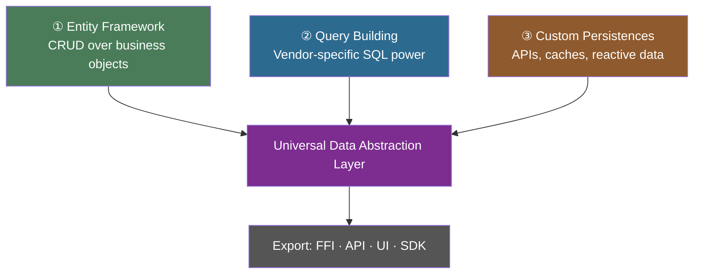

# Three Paths for Developers

Vantage gives you three ways to work with data. Each path builds on the previous one, and all three
converge into a unified data abstraction layer.

<!-- toc -->

---



---

## ① Entity Framework

The most common path. Define entities, build tables, use `DataSet` and `ActiveEntity` for CRUD —
your code never touches SQL or any query language.

```rust
// Define once
#[entity(SurrealType, SqliteType, PostgresType)]
struct Product {
    name: String,
    price: i64,
    is_deleted: bool,
}

// Use everywhere
let table = Product::surreal_table(db);
let expensive = table.with_condition(table["price"].gt(200));
let count = expensive.get_count().await?;

let mut item = table.get_entity(&id).await?.unwrap();
item.price = 350;
item.save().await?;
```

This is the bread and butter of enterprise development — hundreds of entities, each with
relationships, computed fields, and business rules, all persistence-agnostic and testable with
mocks.

```admonish tip title="When to use this path"
You're building business software with well-defined entities (Client, Order, Invoice). You want
clean separation between persistence and logic. You don't need vendor-specific SQL features.
```

---

## ② Query Building

When you need the full power of your database — JOINs, CTEs, window functions, JSONB operators,
array aggregation, recursive queries — drop into the vendor-specific query builder.

### SQLite — CASE, UNION, window functions

```rust
use vantage_sql::primitives::case::Case;

let select = SqliteSelect::new()
    .with_source("users")
    .with_field("name")
    .with_field("salary")
    .with_expression(
        Case::new()
            .when(sqlite_expr!("{} >= {}", (ident("salary")), 100000.0f64),
                  sqlite_expr!("{}", "senior"))
            .when(sqlite_expr!("{} >= {}", (ident("salary")), 60000.0f64),
                  sqlite_expr!("{}", "mid"))
            .else_(sqlite_expr!("{}", "junior"))
            .as_alias("band"),
    )
    .with_order(ident("salary"), Order::Desc);
```

### PostgreSQL — DISTINCT ON, LATERAL JOIN, array ops

```rust
let select = PostgresSelect::new()
    .with_distinct_on(ident("user_id").dot_of("o"))
    .with_source_as("orders", "o")
    .with_expression(ident("name").dot_of("u"))
    .with_expression(ident("id").dot_of("o").with_alias("order_id"))
    .with_expression(ident("total").dot_of("o"))
    .with_join(PostgresSelectJoin::inner(
        "users", "u",
        ident("id").dot_of("u").eq(ident("user_id").dot_of("o")),
    ))
    .with_order(ident("user_id").dot_of("o"), Order::Asc)
    .with_order(ident("created_at").dot_of("o"), Order::Desc);
```

Both examples are type-safe — parameters are bound with the correct CBOR type markers, identifiers
are quoted for the target dialect, and results deserialize into typed structs. See the full test
suites:
[SQLite complex queries](https://github.com/romaninsh/vantage/blob/main/vantage-sql/tests/sqlite/3_complex_queries.rs),
[PostgreSQL complex queries](https://github.com/romaninsh/vantage/blob/main/vantage-sql/tests/postgres/3_complex_queries_pg.rs).

```admonish info title="Bridge back into the entity framework"
Complex queries don't have to live in isolation. Wrap them as expression fields
(`with_expression`) or as custom methods on your `Table` — they become part of the entity
framework, available to every consumer of your model crate.
```

```admonish tip title="When to use this path"
You need vendor-specific features — recursive CTEs, window functions, `DISTINCT ON`,
JSONB operators, `generate_series`, array aggregation. You want full control over the query
while keeping type safety and parameterised binding.
```

---

## ③ Custom Persistences

Vantage isn't limited to databases. Implement the persistence traits for anything that stores or
produces data:

- **REST APIs** — `vantage-api-client` wraps any paginated JSON API as a read-only `TableSource`
- **API pools** — `vantage-api-pool` adds connection pooling, prefetching, and rate limiting
- **CSV files** — `vantage-csv` reads structured files with in-memory conditions
- **Local caches** — `vantage-live` syncs fast cache (ImTable, ReDB) with slow backend (Postgres,
  SurrealDB) for responsive UIs
- **Message queues** — implement `InsertableDataSet` for append-only sources like Kafka topics
- **Mixed sources** — read from SQL, write through a queue, cache in memory — same `Table` interface

```rust
// Read from a REST API
let api_products = Product::api_table(RestApi::new("https://api.example.com/products"));

// Cache locally for fast UI
let live = LiveTable::new(
    Product::surreal_table(db),   // permanent backend
    ImTable::new(&cache, "products"),  // fast cache
);

// Both implement the same traits — your UI code doesn't care
let products: Vec<Product> = live.list().await?.into_values().collect();
```

```admonish tip title="When to use this path"
You're integrating with external APIs, building offline-first applications, implementing
reactive data layers, or combining multiple data sources behind a single interface. Your custom
persistence becomes a first-class citizen in the entity framework.
```

---

## Convergence

All three paths converge into the same **data abstraction layer**. Entity framework tables, raw
query results, and custom persistence data all flow through `Table`, `DataSet`, and `AnyTable` —
giving you one interface for the entire organisation's data.

```text
┌──────────────────────────────────────────────────────────────┐
│                  Data Abstraction Layer                       │
│                                                              │
│   Table<SurrealDB, Client>    ← entity framework             │
│   Table<PostgresDB, Report>   ← complex queries              │
│   Table<RestApi, ExternalData> ← custom persistence          │
│   Table<LiveTable, Product>   ← cached + reactive            │
│                                                              │
│   All implement: DataSet · ValueSet · ActiveEntitySet         │
│   All wrap into: AnyTable (type-erased, generic code)        │
└──────────────────────────────────────────────────────────────┘
                              │
              ┌───────────────┼───────────────┐
              ▼               ▼               ▼
          Axum API        egui/Tauri       FFI / SDK
```

This is where Rust's type system pays off at scale. Every `Table` is checked at compile time. Every
persistence has strict type boundaries. Every consumer works against abstract traits. Add a new
database, API, or cache — nothing else changes. Add a new UI framework or language binding — the
model stays the same.

```admonish success title="The architecture that scales"
Vantage turns your data layer into a universal abstraction. Start with one database and a
handful of entities. Over time, add more persistences, more entities, more consumers. The
architecture doesn't bend — Rust's ownership model and trait system ensure each layer stays
clean, each boundary stays enforced, and each team works independently.
```
