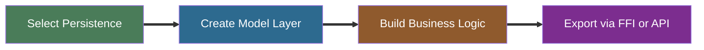

# What's New in Vantage 0.4

Version 0.4 is a **ground-up rewrite of the type system** and a massive expansion of persistence
support. If 0.3 proved the architecture, 0.4 makes it production-ready.

<!-- toc -->

---

## Progressive model — implement only what you need

In earlier versions, adding a new backend meant implementing _everything_. Version 0.4 flips this:
capabilities unlock **progressively** based on which traits your persistence (backend) implements.
There are two parallel trait hierarchies — one for typed entities, one for schema-less records.

**DataSet** works with your Rust structs:

```rust
// A CSV file is read-only — and that's fine
impl ReadableDataSet<Product> for CsvFile { /* ... */ }

// A message queue can only append
impl InsertableDataSet<Event> for KafkaTopic { /* ... */ }

// A full database gets the complete toolkit
impl ReadableDataSet<Client> for SurrealDB { /* ... */ }
impl WritableDataSet<Client> for SurrealDB { /* ... */ }
// ReadableDataSet + WritableDataSet automatically unlocks ActiveEntitySet!
```

**ValueSet** is the schema-less counterpart — same hierarchy, but operates on `Record<Value>`
instead of entities. Useful for dynamic tables, config-driven schemas, or when you don't have (or
want) a struct:

```rust
// Read raw records — no struct needed
impl ReadableValueSet for CsvFile { /* returns Record<CsvType> */ }

// Full CRUD on raw values
impl WritableValueSet for SurrealDB { /* accepts Record<AnySurrealType> */ }
// ReadableValueSet + WritableValueSet automatically unlocks ActiveRecordSet!
```

Each layer is opt-in. A CSV persistence never pretends it can build select queries.

The **DataSource** layer is progressive too. These traits aren't a strict hierarchy — they combine
independently, and each persistence implements only what its engine supports:

```text
DataSource                        ← marker, all backends
 ├── TableSource                  ← CRUD, columns, conditions
 ├── ExprDataSource               ← execute expressions, defer()
 └── SelectableDataSource         ← query builder (Selectable)

TableExprSource                   ← count/sum/max/min as composable expressions
 requires: TableSource + ExprDataSource

TableQuerySource                  ← table definition → full query
 requires: TableSource + SelectableDataSource
```

Here's what each persistence implements:

```text
CSV
 └── TableSource (read-only, in-memory conditions)

REST API  (vantage-api-client)
 ├── TableSource (read-only, HTTP GET)
 └── ExprDataSource (basic resolve)

MongoDB
 ├── TableSource (full CRUD, native bson::Document conditions)
 └── SelectableDataSource (field projection, $match pipeline)
     └── aggregates via native $sum/$max/$min pipeline

Postgres / MySQL / SQLite  (via sqlx)
 ├── TableSource (full CRUD)
 ├── ExprDataSource (parametric SQL execution)
 ├── SelectableDataSource (JOINs, CTEs, window functions)
 └── TableQuerySource

SurrealDB
 ├── TableSource (full CRUD)
 ├── ExprDataSource (CBOR execution)
 ├── SelectableDataSource (SurrealQL builder)
 ├── TableExprSource (composable aggregates)
 ├── TableQuerySource
 └── vendor extensions (graph queries, RELATE, live queries)
```

There's also **MockTableSource** in `vantage-table` and **ImDataSource** in `vantage-dataset` — a
fully in-memory persistence backed by `HashMap<String, IndexMap<String, Record<Value>>>`. Great for
tests and prototyping without any database.

```admonish tip title="Build your own persistence"
Want to add your own? The [Adding a New Persistence](./new-persistence.md) guide walks through
each trait step by step — from type system to full CRUD to multi-backend CLI.
```

---

## Persistence-specific Type Systems

The `vantage-types` crate is the foundation of 0.4. Each persistence defines its own type universe
via the `vantage_type_system!` macro — no more funnelling everything through JSON:

```rust
vantage_type_system!(AnySurrealType, SurrealDB);   // CBOR-native types
vantage_type_system!(AnyMongoType, MongoDB);        // BSON-native types
vantage_type_system!(AnySqliteType, SqliteDB);      // CBOR with integer/real/text markers
vantage_type_system!(AnyPostgresType, PostgresDB);  // CBOR with full PG type coverage
vantage_type_system!(AnyMysqlType, MysqlDB);        // CBOR with MySQL type coverage
```

All SQL backends (SQLite, Postgres, MySQL) now use **CBOR** as their internal value representation —
not JSON. This preserves type fidelity that JSON loses (integer vs float, binary blobs, precise
decimals) while keeping the same `vantage_type_system!` ergonomics.

```admonish note title="SQL type conversions"
Each SQL backend has detailed type conversion tables covering chrono types (DATE, TIME, TIMESTAMP),
numeric types (DECIMAL, BIGINT, FLOAT), and cross-type coercion rules. See the
[Type Conversions](./sql/type-conversions.md) reference for exact round-trip behaviour per column
type and Rust type.
```

Strict conversions replace silent casting — `try_into()` is explicit and fallible:

```rust
let val: i64 = surreal_value.try_into()?;   // fails if it's actually a string
let val: String = mongo_value.try_into()?;   // fails if it's actually a number
```

These types flow through the entire framework, not just storage. **Columns** carry their type as a
generic parameter (`Column<i64>`, `Column<String>`) — surviving type-erasure via `original_type` so
UI adapters can inspect what a column actually holds. **`AssociatedExpression<'a, DS, T, R>`** is
parameterised by the value type `T`, so a count query on SurrealDB returns `AnySurrealType` while
the same query on Postgres returns `AnyPostgresType`. **`AssociatedQueryable<R>`** then converts
that into your expected Rust type — all type-checked at compile time.

```rust
// Column preserves type through erasure
let price = Column::<i64>::new("price").with_flag(ColumnFlag::Sortable);
let erased = Column::<AnyType>::from_column(price);
assert_eq!(erased.get_type(), "i64");  // original type survives

// AssociatedExpression carries the persistence's value type
let count: AssociatedExpression<'_, SurrealDB, AnySurrealType, usize> =
    table.get_expr_count();
let n: usize = count.get().await?;  // executes, converts AnySurrealType → usize
```

This means the full range of your persistence's native types is preserved end-to-end — from column
definition through query building to result extraction — without narrowing down to JSON variants.

---

## Table — the interface you get for free

Once a persistence implements `TableSource`, the framework hands you `Table<DB, Entity>` — a
fully-featured abstraction over your data with columns, conditions, ordering, pagination,
relationships, and aggregates. You don't build any of this yourself; it comes from `vantage-table`.

`Table<DB, E>` auto-implements a wide range of traits from the DataSet and ValueSet hierarchies:
`ReadableDataSet<E>`, `WritableDataSet<E>`, `InsertableDataSet<E>`, `ActiveEntitySet<E>`,
`ReadableValueSet`, `WritableValueSet`, `InsertableValueSet`, and `ActiveRecordSet`. All of these
come for free once your persistence implements `TableSource`.

```rust
let products = Product::table(db)
    .with_condition(products["is_deleted"].eq(false))
    .with_order(products["price"].desc())
    .with_pagination(Pagination::ipp(25));

// ReadableDataSet, WritableDataSet, ActiveEntitySet — all auto-implemented
for (id, product) in products.list().await? { /* ... */ }
let count = products.get_count().await?;
```

Additionally, `table.select()` yields a **vendor-specific query builder** — `SurrealSelect`,
`SqliteSelect`, `PostgresSelect` — giving you full access to the persistence's native query
capabilities when you need to go beyond what the generic `Table` API offers.

This dramatically simplifies implementing new persistences. You implement `TableSource` methods
(read, write, aggregate) and get the entire `Table` API for free — conditions compose automatically,
columns carry types, references traverse between tables, and `AnyTable` type-erasure just works.



Pick your persistence (SurrealDB, Postgres, CSV — or several). Define entities and tables in a
shared model crate. Build business logic against `Table` and `DataSet` traits — persistence-agnostic
and testable with mocks. Finally, expose your model to other languages via FFI (C ABI, PyO3, UniFFI,
WASM) or through API layers (Axum, gRPC). The model stays in Rust; consumers don't need to know.
Read more in [Model-Driven Architecture](./mda.md) and
[Three Paths for Developers](./three-paths.md).

---

## ActiveEntity and ActiveRecord

The `vantage-dataset` crate introduces two flavours of the active record pattern:

**`ActiveEntity<D, E>`** — wraps a typed entity. Derefs straight to your struct, tracks the ID, and
saves back to any `WritableDataSet`:

```rust
let mut user = users.get_entity(&id).await?.unwrap();
user.email = "new@example.com".to_string();  // modify via DerefMut
user.save().await?;                           // persists the change
```

**`ActiveRecord<D>`** — same idea, but schema-less. Works with `Record<Value>` instead of a concrete
struct, perfect for dynamic tables or config-driven entities:

```rust
let mut rec = table.get_value_record(&id).await?;
rec["status"] = json!("active");
rec.save().await?;
```

Both auto-unlock via blanket impls — if your datasource implements `ReadableDataSet` +
`WritableDataSet`, you get `ActiveEntitySet` for free. No extra code.

```admonish example title="Get-or-create pattern"
The API is designed for real-world patterns like get-or-create:
~~~rust
let mut user = users.get_entity(&id).await?
    .unwrap_or_else(|| users.new_entity(id, User::default()));
user.name = "Alice".into();
user.save().await?;
~~~
```

---

## Record\<V\> — persistence-native value bags

`Record<V>` is an `IndexMap<String, V>` wrapper — but `V` is **not** `serde_json::Value`. It's your
persistence's own type. A SurrealDB table returns `Record<AnySurrealType>`, Postgres returns
`Record<AnyPostgresType>`, MongoDB returns `Record<AnyMongoType>`. This ensures the full range of
your persistence's native types is preserved — not narrowed down to what JSON can represent.

```rust
// Each persistence speaks its native types
let record: Record<AnySurrealType> = surreal_table.get_value(&id).await?;
let record: Record<AnyPostgresType> = pg_table.get_value(&id).await?;
let record: Record<AnyMongoType> = mongo_table.get_value(&id).await?;

// Type-safe extraction — respects the persistence's type boundaries
let name: String = record["name"].try_get::<String>().unwrap();
```

`Record` is the common currency across the framework — `ReadableValueSet`, `WritableValueSet`,
`ActiveRecord`, and entity conversion all work through it. JSON conversion only happens at the
boundary when you need `AnyTable` type-erasure (via `from_table()`).

---

## CBOR everywhere

The SurrealDB client switched from JSON to **binary CBOR**, improving serialization performance and
type fidelity. All backends followed — Postgres, MySQL, SQLite.

---

## New persistences

MongoDB, CSV, and REST API persistences joined SurrealDB and SQLite. CSV evaluates conditions
in-memory. MongoDB uses native BSON filters — no expression translation needed:

```rust
// Same handle_commands function — different persistences
handle_commands(SurrealDB::table("product")).await?;
handle_commands(CsvFile::table("products.csv")).await?;
handle_commands(MongoDB::table("product")).await?;
```

---

## Unified error handling

`vantage-core` introduced `VantageError` with structured context — replacing the patchwork of
`Box<dyn Error>` and `.unwrap()` calls:

```rust
use vantage_core::{error, util::error::Context, Result};

connection.connect()
    .with_context(|| error!("Failed to connect", dsn = &dsn, timeout = 30))?;
```

---

## AnyTable goes universal

`AnyTable::from_table()` now wraps **any** datasource whose types convert to/from JSON, using an
internal `JsonAdapter` for on-the-fly conversion. This means your generic code works with
persistences that don't even share a value type:

```rust
// Wrap a MongoDB table for use in generic code
let any: AnyTable = AnyTable::from_table(mongo_products);
let any: AnyTable = AnyTable::from_table(csv_products);
// Both work through the same interface
```

---

## What's still coming

```admonish warning title="Work in progress"
**Trait boundary refinements** — Aggregates (`get_count`, `get_sum`) currently require
`SelectableDataSource` but should only need `TableSource`, so non-query backends like MongoDB
can use them directly. `column_table_values_expr` forces an `ExprDataSource` dependency that
document-oriented backends don't need.

**SurrealDB reference traversal** — `IN` subqueries return record objects instead of scalar
values. Needs `SELECT VALUE id` — a SurrealDB-specific construct not yet in the generic
`Selectable` trait.

**Type system gaps** — `Vec<u8>` (binary data) and `Uuid` need type trait implementations
across backends. Bind/read paths exist — just missing the `impl XxxType` wiring.

**Query builder** — `sql_fx!()` macro for mixed-type function calls, `Expression::empty()`
sweep, PostgreSQL ingress scripts.

**Architecture** — Transaction support, Table JOIN preserving conditions and resolving alias
clashes, `Condition::or()` beyond two arguments, expression refactor (split Owned/Lazy).

**Someday** — Table aggregations (GROUP BY), disjoint subtypes pattern, replayable idempotent
operations, "Realworld" example application.
```

```admonish success title="The 0.4 philosophy"
Don't force every persistence into the same mould. Let each one implement what it can,
carry its own types, and unlock API surface progressively. The framework adapts to the
datasource — not the other way around.
```
