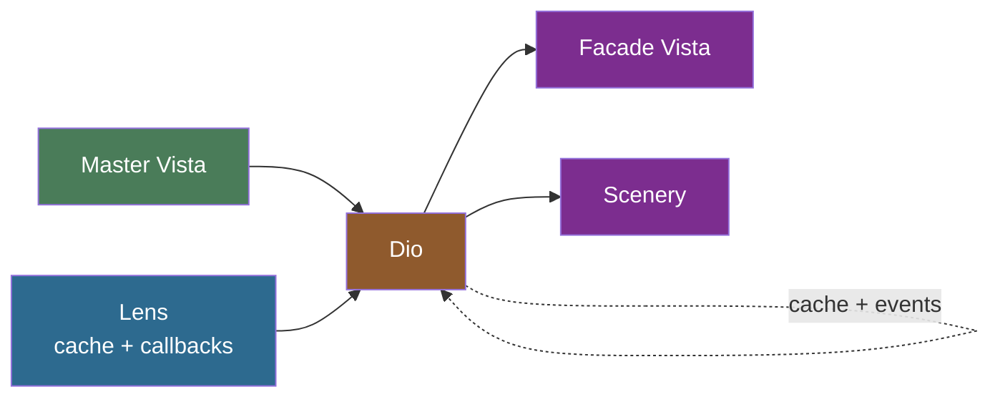

# What's New in Vantage 0.5

Version 0.4 made the type system precise — every backend carries its own types, and a persistence
implements only what its engine supports. Version 0.5 answers the question that follows: **how does
code that doesn't know your entity type talk to your data?**

A CLI that lists any table, a web admin that draws forms from a YAML schema, a UI data grid pointed
at whatever you hand it — none of them know your `Product` struct. 0.4's answer was `AnyTable`:
type-erasure funnelled through JSON. 0.5 replaces it with **`Vista`**, a universal, schema-bearing
data handle, and builds an entire reactive stack on top of it.

<!-- toc -->

---

## Vista — the universal data handle

A [`Vista`](vantage_vista::Vista) wraps any typed `Table<DB, E>` and erases **both** the backend and
the entity. All data flows through `Record<CborValue>` — an ordered map of string keys to CBOR
values. All schema lives on the Vista itself: columns (with types and flags), references, the id
column, and a set of capability flags. Execution is delegated to a per-driver
[`TableShell`](vantage_vista::TableShell).

```text
Table<SqliteDB, Product>   — typed entity, typed backend, compile-time safe
Vista                      — fully erased: schema-bearing, CborValue, no generics
```

Each backend ships a factory that turns a typed table into a Vista. The factory harvests columns, id
field, title fields, and references from the table definition you already built — no extra mapping
code:

```rust
use vantage_sql::prelude::*;
use vantage_vista::Vista;

let table = Product::table(db.clone());
let vista = SqliteVistaFactory::new(db).from_table(table)?;
```

For MongoDB it's `MongoVistaFactory`, for AWS `AwsVistaFactory` — same shape, different import. The
resulting `Vista` is identical regardless of which factory produced it. From there, everything is
runtime introspection:

```rust
// Schema — no entity type required
for name in vista.get_column_names() {
    let col = vista.get_column(name).unwrap();
    println!("{}: {}", col.name, col.original_type);  // name: String, price: i64, ...
}
for (name, kind) in vista.list_references() {
    println!("ref: {} ({:?})", name, kind);           // ref: products (HasMany)
}

// Query — Vista delegates the value to the driver's native condition type
let mut v = vista.clone();
v.add_condition_eq("category_id", 1.into())?;
v.add_search("tart")?;                                 // fans across SEARCHABLE columns
v.add_order("price", SortDirection::Descending)?;
let rows = v.fetch_page(1).await?;
```

```admonish info title="Conditions mutate; Table builds"
Unlike `Table`'s `.with_condition()` (consume-and-return), Vista's `add_condition_eq` /
`add_search` / `add_order` mutate in place — it's a runtime handle, not a builder. Search and order
are **replace semantics** (calling again drops the previous one). Clone before narrowing if you need
the unfiltered handle later.
```

---

## CBOR, not JSON

Where `AnyTable` narrowed every value to `serde_json::Value`, Vista carries
[`ciborium::Value`](https://docs.rs/ciborium) end to end. CBOR preserves the type fidelity JSON
loses — integer vs float, binary blobs, precise decimals — so a `Record<CborValue>` round-trips
through the Vista layer without lossy hops. JSON conversion happens only at the boundary, when you
actually need it (an HTTP response, for example), and it's a one-liner.

This is the same carrier the backends already use internally (Surreal and SQL store CBOR; Mongo
stores BSON), so wrapping a typed table into a Vista no longer crosses a JSON funnel.

---

## Capabilities — the explicit contract

Not every backend can do everything. A CSV file can't sort or search server-side; DynamoDB orders
only by its declared sort key; a token-paginated REST API offers a forward cursor but no page
numbers. Vista makes this explicit with
[`VistaCapabilities`](vantage_vista::VistaCapabilities) — a struct of booleans where each driver
declares exactly what it supports:

```rust
let caps = vista.capabilities();
if caps.can_search { v.add_search("query")?; }
if caps.can_fetch_page {
    let page = v.fetch_page(2).await?;          // random access
} else if caps.can_fetch_next {
    let (rows, token) = v.fetch_next(None).await?;  // forward cursor
}
```

```admonish warning title="Unsupported is an error, not a no-op"
The flags aren't suggestions — they're a contract. Calling `add_search()` when `can_search` is
`false` returns an `Unsupported` error. If a flag is `true` but the driver forgot to implement the
method, you get `Unimplemented` instead. Both are `VantageError` variants you can match on. It's
better to fail clearly than to silently return an unfiltered result set — a principle 0.6 then drove
through every remaining path.
```

UI adapters branch on these flags directly: a data grid checks `can_fetch_page` to decide between a
scrollbar (random access) and a "load more" button (cursor-based).

---

## Config-driven: YAML specs and Rhai scripting

A Vista no longer needs a hand-written Rust definition. Tables, columns, and relations can be
declared in a **YAML spec** ([`VistaSpec`](vantage_vista::VistaSpec)) and materialized by the
driver's factory:

```yaml
table: product
columns:
  - { name: name, flags: [title, searchable] }
  - { name: price }
references:
  - { name: orders, kind: has_many, foreign_key: product_id }
```

For everything YAML can't express — vendor-specific expressions, derived sources, scripted reference
traversal — there's an optional **Rhai** DSL that compiles to native queries. The same script
renders dialect-correct SQL across all three SQL backends:

```rust
let users = table("users").alias("u");
select()
    .from(users)
    .expression(users["name"])
    .where(users["age"] >= 18)
    .order_by(users["name"], "asc")
```

- Automatic identifier quoting (backticks for MySQL, double quotes for Postgres/SQLite)
- Dialect-aware primitives: `date_format()` → `strftime()` / `TO_CHAR()` / `DATE_FORMAT()`
- `group_concat()` → `GROUP_CONCAT` (SQLite/MySQL) / `STRING_AGG` (Postgres)

SurrealDB gets its own Rhai vocabulary — graph traversal (`graph()`/`recurse()`), record ids
(`thing`), `$parent` references, and SurrealDB-namespaced aggregates. A per-reference Rhai script can
even override the default foreign-key traversal, evaluated lazily with the parent `row` in scope.

```admonish note title="YAML primary, Rhai targeted"
YAML stays the canonical, declarative table format. Rhai is a serializable escape hatch you reach
for only when a relationship or source needs vendor expressions a YAML key can't represent. Engine-less
backends still understand a *conventional* uniform vocabulary (`table`, `with_id`, `add_condition_eq`,
`add_order`) and only lose vendor-specific expression syntax — graceful degradation, not a hard
requirement.
```

---

## Contained relations and nested writes

Embedded objects and arrays — an order's `lines` array, a row's JSON column — now surface as a fully
**editable sub-Vista**:

```rust
let order = Order::table(db)
    .with_contained_many("lines", |line| {
        line.with_column("product_id").with_column("quantity")
    });
```

SurrealDB backs contained relations with native nested objects and arrays; the SQL backends store
them as JSON columns and patch the host column on writeback. Reads project the column into records;
writes re-serialize the whole collection and patch the parent row. Contained records can even
traverse out to real tables (`line.product`).

Insert learned to walk relations, too. Hand `insert_value` a record whose keys name a **relation**
instead of a column, and Vista sequences the writes so foreign keys populate automatically: a
has-one child is inserted first and its id stamped into the parent's FK; has-many children are
inserted after the parent with the parent's id stamped into each. Arbitrary depth, same-persistence
relations only.

```admonish warning title="Best-effort, non-atomic"
Nested insert is best-effort and non-atomic — a mid-sequence failure leaves earlier writes
committed. Transaction support is still on the roadmap.
```

---

## Diorama — caching, events, and reactive views

The largest new subsystem is **`vantage-diorama`**, a layer that sits between a Vista and whatever
consumes it. It does three things: caches transparently, injects capabilities the backend lacks, and
routes writes wherever you want.



Four words you'll see throughout:

- **Vista** — a single-backend data source (the master).
- **Lens** — long-lived shared infrastructure: cache backend, lifecycle callbacks, refresh policy.
  Built once per application.
- **Dio** — a Vista bound to a Lens. Owns the cache table, a write queue, an event bus, and a
  refresh task. Produced by `lens.make_dio(vista)`.
- **Scenery** — a reactive view onto a Dio (ordered tables, individual records, aggregates). The UI
  binds here.

```rust
let lens = Arc::new(
    Lens::new()
        .cache_at("./cache.redb")
        .on_start(|dio| { let dio = dio.clone(); async move {
            let rows = dio.master().list_values().await?;   // seed cache from master
            dio.cache().insert_values(rows).await?;
            Ok(())
        }})
        .refresh_every(Duration::from_secs(300))
        .build()?,
);

let products = lens.make_dio(products_vista).await?;
let mut v = products.vista();          // facade: reads from cache, writes through the queue
let rows = v.list_values().await?;     // cache hit — never touches the master
```

```admonish success title="Capability injection"
Diorama caches the full dataset locally and answers queries from it. So a read-only CSV Vista that
_can't_ paginate, sort, or search server-side becomes one that can — the consumer sees a richer
Vista than the backend actually supports. Register an `on_write` callback and the facade gains
`can_insert` too, even though the master is read-only: writes land in the queue and you route them
wherever you like (a Kafka topic, a different database).
```

Writes go through a queue as `WriteOp`s; the cache updates immediately and persistence happens
asynchronously. A `broadcast` event bus publishes `DioEvent`s (record changed, inserted, removed,
invalidated) that Sceneries subscribe to. Upstream changes — another user's edit, a database
trigger, a webhook — feed in as `ChangeEvent`s through an `on_event` callback that reconciles them
into the cache.

**Two-pass progressive loading** handles slow sources: a cheap *list pass* renders immediately, and
expensive per-row *detail* hydrates lazily as rows scroll into view, keyed per query so filter/sort
variants share the detail store without blocking the UI.

---

## Cross-persistence traversal: VistaCatalog

A reference can cross a backend boundary — categories in Postgres, products in MongoDB. In 0.5 that's
no longer a `Vista` concern (a `Vista` is strictly single-backend). It moved up into
**`vantage-vista-factory`**'s `VistaCatalog`: register a model loader per table name, then
`build_vista(name)` materializes a Vista and `traverse(relation, parent_row)` resolves and narrows
the related Vista regardless of which persistence backs it.

```rust
let catalog = VistaCatalog::new();
catalog.register("category", |name| postgres_factory.build(name));
catalog.register("product",  |name| mongo_factory.build(name));

let category = catalog.build_vista("category").await?;
let products = catalog.traverse("products", &category_row).await?;  // Postgres → MongoDB
```

---

## More backends

0.5 widened the roster around the Vista abstraction:

| Crate                | Backend                                                          |
| -------------------- | --------------------------------------------------------------- |
| `vantage-redb`       | Embedded key-value store (uses `ColumnFlag::Indexed` for real indexes) |
| `vantage-aws`        | DynamoDB and friends — `Factory::for_name` / `from_arn` return Vistas directly |
| `vantage-cmd`        | A shell script becomes a queryable table (separate `list` / `detail` scripts) |
| `vantage-api-pool`   | Pooled REST API access                                          |

Each implements `TableShell` and slots into the same Vista surface, the same YAML/Rhai config, and
the same Diorama caching — nothing downstream changes.

---

## Migrating off AnyTable

`AnyTable` is gone. The carrier, `AnyRecord`, the `CborAdapter`, `Table::get_ref` (the
`AnyTable`-returning one), `Reference::resolve_as_any`, and the `model_cli` runner were all deleted
across the 0.5.x line.

```admonish tip title="The replacement, in one line"
Anywhere you wrote `AnyTable::from_table(table)`, write `T::vista_factory().from_table(table)?` to
get a `Vista`. The typed `Table::get_ref_as` and `Table::get_subquery_as` survive untouched — they
never went through `AnyTable`. For the row-driven case, prefer `Table::get_ref_from_row`.
```

The CLI runner story collapsed to one path: `vista_cli` (in `vantage-cli-util`), which has carried
the full token grammar — operators, selectors, search, aggregates — since 0.4.5 and is what every
in-tree consumer already uses.

---

## What's still coming

```admonish warning title="Work in progress"
**Transactions** — nested insert and multi-step writes are best-effort and non-atomic today.

**Live queries** — `can_subscribe` is wired through the capability struct but SurrealDB live-query
push is still a later pass; Diorama's event bus is the interim path.

**Multi-column ordering** — `add_order` is single-column for now; the signature already accommodates
the multi-column future.

**Type system gaps** — `Vec<u8>` (binary) and `Uuid` still need trait wiring across every backend.
```

```admonish success title="The 0.5 philosophy"
Keep the typed layer where you know your entity, and rise to a single universal handle — `Vista` —
where you don't. Let each backend advertise exactly what it supports, and let a caching layer fill
the gaps. The framework adapts to the datasource; the consumer writes against one shape.
```
