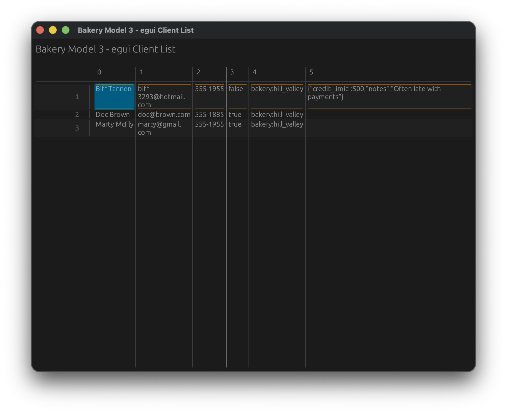

# egui Table Example

A desktop application demonstrating Vantage UI Adapters with the egui framework, displaying real SurrealDB data.



## Overview

This example shows how to integrate [Vantage UI Adapters](https://github.com/romaninsh/vantage/tree/main/vantage-ui-adapters) with egui to display client data from SurrealDB in an immediate mode GUI desktop application.

## Quick Start

```bash
# Start SurrealDB and populate with data
cd ../vantage-surrealdb
./run.sh
# In another terminal:
./ingress.sh

# Run the egui example
cd ../example_egui
cargo run
```

## Code Example

```rust
use bakery_model3::*;
use dataset_ui_adapters::{egui_adapter::EguiTable, TableStore, VantageTableAdapter};
use eframe::egui;

struct TableApp {
    table: EguiTable<VantageTableAdapter<Client>>,
}

impl TableApp {
    async fn new() -> Result<Self, Box<dyn std::error::Error>> {
        bakery_model3::connect_surrealdb().await?;
        let client_table = Client::table();
        let dataset = VantageTableAdapter::new(client_table).await;
        let store = TableStore::new(dataset);
        let table = EguiTable::new(store).await;
        Ok(Self { table })
    }
}

impl eframe::App for TableApp {
    fn update(&mut self, ctx: &egui::Context, _frame: &mut eframe::Frame) {
        egui::CentralPanel::default().show(ctx, |ui| {
            ui.heading("Bakery Model 3 - egui Client List");
            self.table.show(ui);
        });
    }
}
```

## Features

- **Immediate Mode GUI**: Fast iteration and development with egui
- **Real Database Data**: Displays actual SurrealDB client records
- **Cross-Platform**: Runs on Windows, macOS, and Linux
- **Async Data Loading**: Non-blocking data fetching through Vantage adapters

## Requirements

- SurrealDB server running on `ws://localhost:8000`
- Rust with egui dependencies
- Sample data populated via `vantage-surrealdb/ingress.sh`

## Integration

This example is part of the [Vantage UI Adapters](https://github.com/romaninsh/vantage/tree/main/vantage-ui-adapters) ecosystem, demonstrating how the same data layer works across different UI frameworks.
