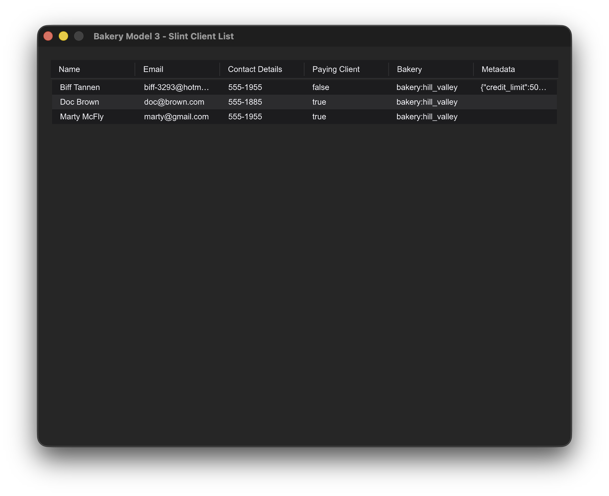

# Slint Table Example

A desktop application demonstrating Vantage UI Adapters with the Slint framework, displaying real SurrealDB data.



## Overview

This example shows how to integrate [Vantage UI Adapters](https://github.com/romaninsh/vantage/tree/main/vantage-ui-adapters) with Slint to display client data from SurrealDB in a declarative, native UI desktop application.

## Quick Start

```bash
# Start SurrealDB and populate with data
cd ../vantage-surrealdb
./run.sh
# In another terminal:
./ingress.sh

# Run the Slint example
cd ../example_slint
cargo run
```

## Code Example

```rust
use bakery_model3::*;
use dataset_ui_adapters::{slint_adapter::SlintTable, TableStore, VantageTableAdapter};
use slint::{ComponentHandle, Model, ModelRc, VecModel};

slint::include_modules!();

#[tokio::main]
async fn main() -> Result<(), slint::PlatformError> {
    // Connect to SurrealDB and get client table
    bakery_model3::connect_surrealdb().await.expect("Failed to connect to SurrealDB");

    let client_table = Client::table();
    let dataset = VantageTableAdapter::new(client_table).await;
    let store = TableStore::new(dataset);
    let table = SlintTable::new(store).await;
    let window = MainWindow::new()?;

    // Convert adapter data to Slint format
    let model_rc = table.as_model_rc();
    let mut slint_rows = Vec::new();

    for i in 0..model_rc.row_count() {
        if let Some(row) = model_rc.row_data(i) {
            let standard_items: Vec<slint::StandardListViewItem> = row
                .cells
                .iter()
                .map(|cell| slint::StandardListViewItem::from(cell.as_str()))
                .collect();
            let row_model = ModelRc::from(Rc::new(VecModel::from(standard_items)));
            slint_rows.push(row_model);
        }
    }

    let table_model = Rc::new(VecModel::from(slint_rows));
    window.set_table_rows(ModelRc::from(table_model));

    window.run()
}
```

## Features

- **Declarative UI**: Built with Slint's declarative markup language
- **Real Database Data**: Displays actual SurrealDB client records
- **Native Performance**: Compiled to native code with GPU acceleration
- **Async Data Loading**: Non-blocking data fetching through Vantage adapters

## Requirements

- SurrealDB server running on `ws://localhost:8000`
- Rust with Slint dependencies
- Sample data populated via `vantage-surrealdb/ingress.sh`

## Integration

This example is part of the [Vantage UI Adapters](https://github.com/romaninsh/vantage/tree/main/vantage-ui-adapters) ecosystem, demonstrating how the same data layer works across different UI frameworks.
