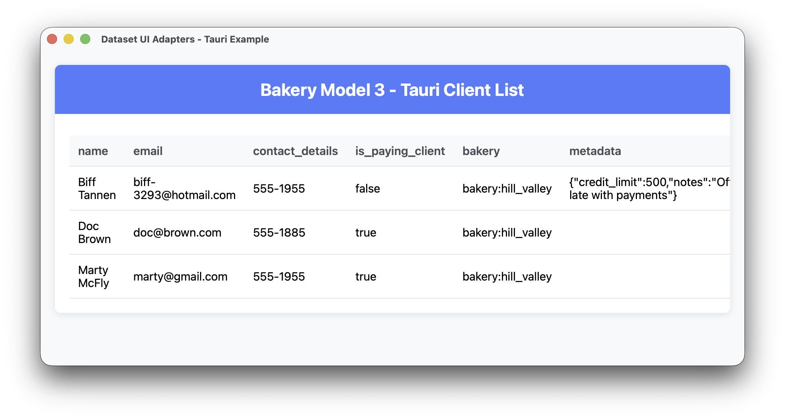

# Tauri Table Example

A web-based desktop application demonstrating Vantage UI Adapters with the Tauri framework, displaying real SurrealDB data.



## Overview

This example shows how to integrate [Vantage UI Adapters](https://github.com/romaninsh/vantage/tree/main/vantage-ui-adapters) with Tauri to display client data from SurrealDB in a web-based desktop application.

## Quick Start

```bash
# Start SurrealDB and populate with data
cd ../vantage-surrealdb
./run.sh
# In another terminal:
./ingress.sh

# Run the Tauri example
cd ../example_tauri
cargo run dev
```

## Code Example

### Rust Backend (`src-tauri/src/main.rs`)

```rust
use bakery_model3::*;
use dataset_ui_adapters::{tauri_adapter::TauriTable, TableStore, VantageTableAdapter};

#[tokio::main]
async fn main() {
    bakery_model3::connect_surrealdb().await.expect("Failed to connect to SurrealDB");

    let client_table = Client::table();
    let dataset = VantageTableAdapter::new(client_table).await;
    let store = TableStore::new(dataset);
    let table = TauriTable::new(store).await;

    tauri::Builder::default()
        .manage(table)
        .invoke_handler(tauri::generate_handler![get_table_data, get_table_columns])
        .run(tauri::generate_context!())
        .expect("error while running tauri application");
}

#[tauri::command]
async fn get_table_data(
    table: tauri::State<'_, TauriTable<VantageTableAdapter<Client>>>,
) -> Result<serde_json::Value, String> {
    let all_rows = table.get_rows();
    let rows: Vec<Vec<String>> = all_rows.iter().map(|row| row.cells.clone()).collect();
    Ok(serde_json::json!({ "rows": rows }))
}
```

### Frontend (`src/index.html`)

```javascript
async function loadData() {
  try {
    const columns = await invoke("get_table_columns");
    const result = await invoke("get_table_data");

    // Build HTML table with data
    renderTable(columns, result.rows);
  } catch (error) {
    console.error("Failed to load data:", error);
  }
}
```

## Features

- **Web Technologies**: HTML, CSS, JavaScript frontend with Rust backend
- **Real Database Data**: Displays actual SurrealDB client records
- **Desktop Integration**: Native desktop app with web UI flexibility
- **Async Data Loading**: Non-blocking data fetching through Vantage adapters

## Requirements

- SurrealDB server running on `ws://localhost:8000`
- Rust with Tauri dependencies
- Node.js for frontend dependencies
- Sample data populated via `vantage-surrealdb/ingress.sh`

## Integration

This example is part of the [Vantage UI Adapters](https://github.com/romaninsh/vantage/tree/main/vantage-ui-adapters) ecosystem, demonstrating how the same data layer works across different UI frameworks.
