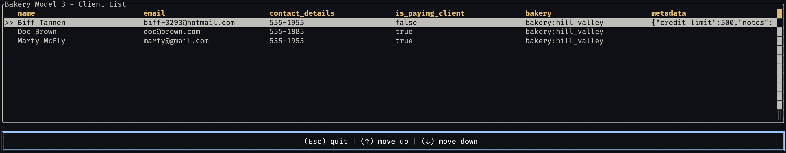

# Ratatui Table Example

A terminal application demonstrating Vantage UI Adapters with the Ratatui framework, displaying real SurrealDB data.



## Overview

This example shows how to integrate [Vantage UI Adapters](https://github.com/romaninsh/vantage/tree/main/vantage-ui-adapters) with Ratatui to display client data from SurrealDB in a modern terminal user interface.

## Quick Start

```bash
# Start SurrealDB and populate with data
cd ../vantage-surrealdb
./run.sh
# In another terminal:
./ingress.sh

# Run the Ratatui example
cd ../example_tui
cargo run
```

## Code Example

```rust
use bakery_model3::*;
use dataset_ui_adapters::{ratatui_adapter::RatatuiTableAdapter, TableStore, VantageTableAdapter};
use crossterm::event::{self, Event, KeyCode, KeyEventKind};
use ratatui::DefaultTerminal;

struct App<D: dataset_ui_adapters::DataSet + 'static> {
    adapter: RatatuiTableAdapter<D>,
}

impl<D: dataset_ui_adapters::DataSet + 'static> App<D> {
    async fn new(store: TableStore<D>) -> Self {
        let mut adapter = RatatuiTableAdapter::new(store);
        adapter.refresh_data().await;
        Self { adapter }
    }

    fn run(mut self, mut terminal: DefaultTerminal) -> Result<()> {
        loop {
            terminal.draw(|frame| {
                let table = self.adapter.create_table();
                frame.render_stateful_widget(table, frame.area(), self.adapter.state_mut());
            })?;

            if let Event::Key(key) = event::read()? {
                match key.code {
                    KeyCode::Char('q') | KeyCode::Esc => return Ok(()),
                    KeyCode::Down => self.adapter.next_row(),
                    KeyCode::Up => self.adapter.previous_row(),
                    _ => {}
                }
            }
        }
    }
}

#[tokio::main]
async fn main() -> Result<()> {
    bakery_model3::connect_surrealdb().await?;
    let client_table = Client::table();
    let dataset = VantageTableAdapter::new(client_table).await;
    let store = TableStore::new(dataset);

    let terminal = ratatui::init();
    let app = App::new(store).await;
    let result = app.run(terminal);
    ratatui::restore();
    result
}
```

## Controls

- **↑/↓ Arrow Keys**: Navigate up/down through table rows
- **j/k**: Vim-style navigation (down/up)
- **q/Esc**: Quit the application
- **r**: Refresh data (in some implementations)

## Features

- **Modern Terminal UI**: Rich text-based interface with borders and styling
- **Real Database Data**: Displays actual SurrealDB client records
- **Keyboard Navigation**: Intuitive controls with vim-like key bindings
- **Async Data Loading**: Non-blocking data fetching through Vantage adapters

## Requirements

- SurrealDB server running on `ws://localhost:8000`
- Rust with Ratatui dependencies
- Terminal with color support
- Sample data populated via `vantage-surrealdb/ingress.sh`

## Integration

This example is part of the [Vantage UI Adapters](https://github.com/romaninsh/vantage/tree/main/vantage-ui-adapters) ecosystem, demonstrating how the same data layer works across different UI frameworks.
