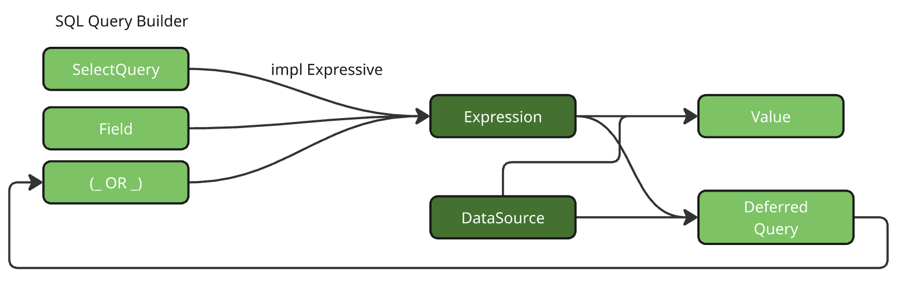

# Vantage Expressions

A base crate for creating **Query Builders** in Rust. A fundamental part of Vantage
framework and comes with the following implementations, but can be further expanded for
other database engines:

- vantage-sql (SQLx compatible databases)
- vantage-surrealdb (SurrealQL query builder)
- vantage-mongodb (MongoDB query language)
- vantage-csv (Queries for local tranformation of CSV data)

All **Query Builders** written using vantage-expressions will be cross-compatible,
meaning you can build expressions that query data across multiple databases.

## Query Builder Features

A Query builder implemented with `vantage-expressions` will generally have the following
features:

- Create expressions using a macro (`expr!`) with parameters (no sql-injections)
- Expressions can encapsulate other expressions
- Expressions can contain closures that resolve at query execution time
- Structs (like `QuerySelect`) can resolve into part of expression.
- Operator support (like `Field("age").gt(18)`)
- Support for return types
- Async and Multithreaded support

## Core parts of vantage-expressions

Vantage-expressions come with a ready-to-use Expression implementation based around
`string` templates and `serde_json::Value` parameters. In your qurey builder, you
can use `vantage-expressions::Expression` or create your own expression implementation.

You can read more about creating your own expression implementation in `docs/custom-expression.md`



1. **Expressions**: The core unit of query consisting of template and vec![parameters]
2. **IntoParameter**: A trait for converting various native types into parameters.
3. **Expressive**: A trait for creating complex types into expressions.
4. **DataSource**: A trait for allowing your database to execute or defer expressions.
5. **DeferredExpression**: A trait allowing to convert deferred expressions into parameters.
6. **Flattening**: A system to execute deferred parameters while flattening nested expressions.
7. **Selectable**: A trait for standardizing "Select" builders across backends.

### Quick Walkthrough - Creating Expressions

A most basic way to create an expression, is using the `expr!` macro provided by the crate.
Lets create expression with a parameter:

```rust
use vantage_expressions::{expr, Expression, IntoExpressive};

// Create expressions using the expr! macro
let final_query = expr!("SELECT * FROM users WHERE age > {}", 18);
```

Query takes ownership of your parameters (such as integer 18), but keeps it separate from the
query template, passing it to a database driver instead to avoid any SQL injection.

You can pass another expression as a parameter though:

```rust
// Expressions can be nested and composed
let condition = expr!("status = {}", "active");
let final_query = expr!("SELECT * FROM users WHERE age > {} AND {}", 18, condition);
```

Once again, `"active"` will be kept as a parameter and passed into DataSource. Expression
has a handy `preview()` method, which will render parameters into a query, but must
not be used for anything other than debug.

### Using Query Builder

Using expressions directly is no fun. Lets rewrite the above query using `vantage-sql`
query builder:

```rust
use vantage_sql::{SelectQuery, Field};

let query = SelectQuery::new()
    .with_source("users")
    .with_condition(Field::new("age").gt(18))
    .with_condition(Field::new("status").eq("active"))
    ;

let final_query = query.expr();
```

The result will be the same, but SelectQuery builder can be modified quite flexibly
based on your needs. For instance you can add pagination to your query:

```rust
let query = query.with_limit(10, 20); // return 20..30 results
```

### `DataSource<T>` - Executing queries

DataSource should be implemented for your Database driver. For instance,
in `vantage-sql` you get PostgreSQL:

```rust
impl DataSource<Expression> for PostgreSQL {
    async fn execute(&self, expr: &Expression) -> Value {
        // Execute now and return value
    }

    fn defer(&self, expr: Expression) -> impl Fn() -> Pin<Box<dyn Future<Output = Value> + Send>> + Send + Sync + 'static {
        // Return a closure, which will execute and return value later
    }
```

We can now execute our query:

```rust
let db = PostgreSQL::dsn(dsn);
let result = db.execute(final_query).await?;
```

### Switching Databases

Select query is generally similar for most databases, so it's possible to switch to MongoDB
without rewriting your queries:

```rust
use vantage_mongodb::{SelectQuery, Field};

let query = SelectQuery::new()
    .with_source("users")
    .with_condition(Field::new("age").gt(18))
    .with_condition(Field::new("status").eq("active"))


let db = MongoDB::dsn(dsn);
let result = db.execute(final_query).await?;
```

A trait `selectable` provides basic interface for all select query implementations.
If you are using some vendor-specific features, you might need to change your code
a little, but most errors will be highlighted by Rust at compile time.

### Switching between databases

Sometimes you want to use result of a MongoDB query in a condition for your
SQL query:

```rust
let query = vantage_mongodb::SelectQuery::new()
    .with_source("countries")
    .with_condition(Field::new("is_eu").eq(true))
    .only_column(Field("iso_code"));

let mongodb = MongoDB::dsn(dsn);
let countries = mongodb.defer(query);


let eu_client_query = vantage_sql::SelectQuery::new()
    .with_source("client")
    .with_condition(Field::new("country_iso_code").eq(countries));

let sql = PostgreSQL::dsn(dsn);
let eu_clients = db.execute(eu_client_query).await?;
```

Notice how query-building did not require any `await` while building. Queries
to both databases would be executed at the last await and results from MongoDB
automatically passed into SQL query as a parameter.

### Custom Query<->DB mechanics

Inside your QueryBuilder language you can rely on custom features, such as
executing queries together or forming transactions:

```rust
let (sum, count, records) = db.execute_all([sum_query, count_query, paginated_query]).await?;
```

Vantage encourages you to bring out your unique query language features
and database capabilities.

## Best Practices for Backend Implementers

Consult `docs` for specific guides on advanced scenarios in implementing
your DataSource.

1. Start by using `Expression` with your custom DataSource implementation.
2. Implement `IntoExpressive<T>` for your types to allow them to be used in expressions parameters.
3. Implement `Expressive` for complex types that can be converted into expressions.
4. Implement `Selectable` for standardizing select queries across backends.
5. Implement `Fx` and `Operators` for best developer experience.
6. Use Rust types where possible
7. Add unique features of your database gradually.
